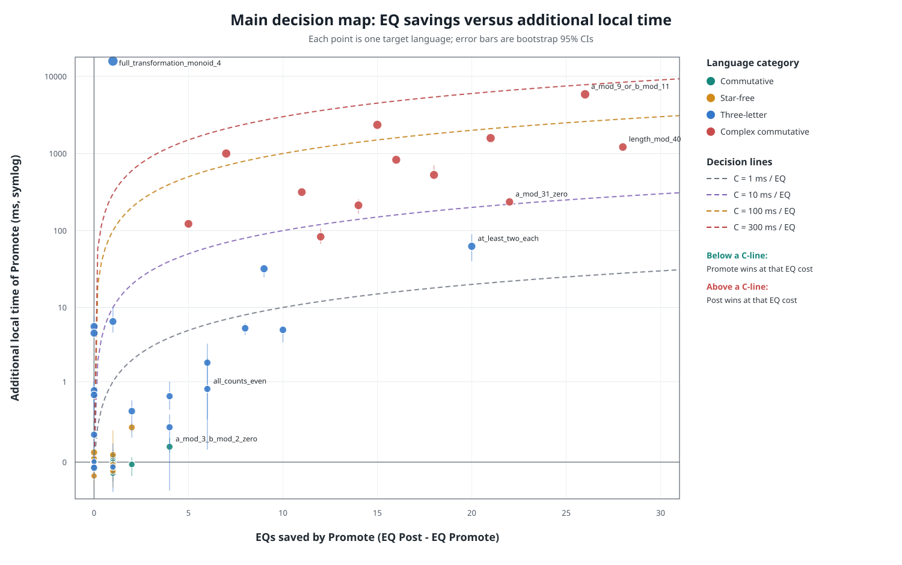
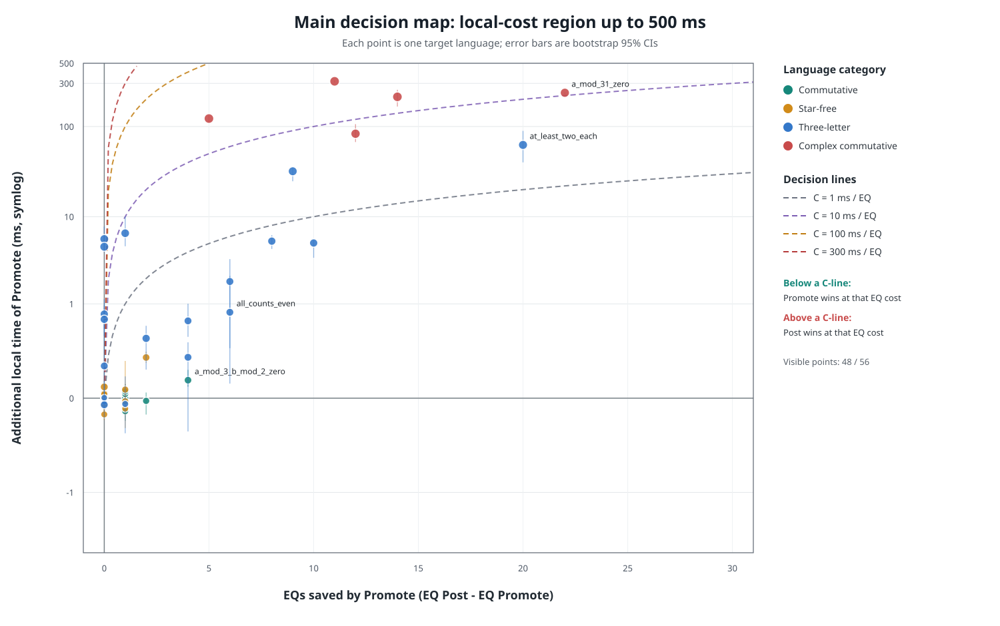

# Post 与 Promote 主决策图实验

实验日期：2026-08-23
代码版本：`8a90c0b + 本次统计修改`
平台：`Windows-11-10.0.26200-SP0`
处理器：`AMD64 Family 25 Model 117 Stepping 2, AuthenticAMD`
Python：`3.14.3`

## 1. 新图表的目的

主决策图不再比较单纯的 EQ 比率和 Cells 比率，而是直接比较 Promote 的收益与代价。每个点代表一个目标语言。

横轴定义为：

$$
\Delta EQ = EQ_{Post}-EQ_{Promote}
$$

它表示 Promote 实际节省了多少次 EQ。点越靠右，Promote 的外部查询优势越大。

纵轴定义为：

$$
\Delta T_{local}=T_{Promote,local}-T_{Post,local}
$$

其中每次运行都直接计算：

$$
T_{local}^{(i)}=T_{total}^{(i)}-T_{EQ}^{(i)}
$$

然后对 local 样本自身取中位数。纵轴大于零表示 Promote 付出了更多本地计算，纵轴小于零表示 Promote 本地计算也更快。

## 2. 决策线与判断规则

假设真实环境中一次 EQ 的平均成本为 $C$ ms，则两种策略的边界是：

$$
\Delta T_{local}=C\,\Delta EQ
$$

图中分别绘制 $C=1,10,100,300$ ms/EQ 的决策线。对于给定的 $C$：

- 点在线下方：Promote 节省的 EQ 成本超过其额外本地成本，Promote 更优。
- 点在线上方：额外本地成本尚未被 EQ 节省抵消，Post 更优。
- 右下象限：Promote 同时减少 EQ 且降低本地时间，Promote 严格占优。
- 左上象限：Promote 同时增加 EQ 和本地时间，Post 严格占优。

单语言盈亏平衡成本定义为：

$$
C^*=\frac{\Delta T_{local}}{\Delta EQ}
$$

当真实 EQ 成本高于 $C^*$ 时 Promote 更合适。$C^*$ 是平台相关的工程指标，不是语言固定不变的理论性质。

## 3. 实验方法

- 复用现有 56 个语言；正式重复次数为：交换语言 15 次, Star-free 语言 15 次, 三字母语言 7 次, 复杂交换语言 7 次。
- 每个用例先各预热一次，并在正式测量中交替策略顺序。
- `gc.collect()` 在计时开始前执行；目标 DFA、Oracle 构造和最终额外正确性验证不计入 learner 时间。
- 每次运行保存 total、EQ、local 和 Monoid Check 原始时间样本。
- 表格报告 local 中位数及四分位区间；图中误差棒为独立样本 bootstrap 的中位数差 95% 区间。
- 给定 EQ 成本后，只有误差棒整体位于决策线下方/上方时才分别判为 Promote/Post；误差棒穿过决策线时记为 Inconclusive。
- 所有运行验证最终语言等价、学习状态数等于目标 syntactic monoid 大小，且 Promote 不执行 Monoid Consistency Check。

原始 JSON 位于 [`benchmark_data/`](benchmark_data/)，图位于 [`figures/`](figures/)。

## 4. 分组汇总

| Group | Cases | Σ Local median ms Post/Promote | ΔLocal ms | EQ Post/Promote | ΔEQ | Group C* ms/EQ | Cells Post/Promote |
|---|---:|---:|---:|---:|---:|---:|---:|
| 交换语言 | 12 | 3.911/3.933 | 0.021 | 26/16 | 10 | 0.002 | 226/956 |
| Star-free 语言 | 12 | 5.146/5.270 | 0.124 | 28/23 | 5 | 0.025 | 473/1,547 |
| 三字母语言 | 20 | 1,851.85/17,779.70 | 15,927.85 | 126/54 | 72 | 221.22 | 19,116/688,202 |
| 复杂交换语言 | 12 | 5,633.83/19,972.35 | 14,338.52 | 269/74 | 195 | 73.53 | 33,541/2,109,238 |
| 合计 | 56 | 7,494.74/37,761.25 | 30,266.51 | 449/167 | 282 | 107.33 | 53,356/2,799,943 |

## 5. 不同 EQ 成本下的策略选择

| Assumed real EQ cost | Promote languages | Post languages | Inconclusive |
|---:|---:|---:|---:|
| 1 ms/EQ | 21 | 22 | 13 |
| 10 ms/EQ | 24 | 18 | 14 |
| 100 ms/EQ | 33 | 10 | 13 |
| 300 ms/EQ | 36 | 7 | 13 |

这一表格只代入 EQ 成本，暂时把 MQ 的外部成本视为相同或可忽略。若真实 MQ 也昂贵，应进一步加入 $\Delta MQ\cdot C_{MQ}$。Inconclusive 表示 bootstrap 95% 区间与决策线相交，并不表示两种策略已被证明等价。

## 6. 各语言统计数据

`Local IQR` 为 `[Q1, Q3]`；`ΔEQ` 为 Post 减 Promote；`ΔLocal` 为 Promote 减 Post。

### 6.1 交换语言

| Case | DFA | Monoid | Total ms Post/Promote | Local ms Post/Promote | Local IQR Post/Promote | EQ Post/Promote | ΔEQ | ΔLocal ms | C* ms/EQ | MQ Post/Promote | Cells Post/Promote |
|---|---:|---:|---:|---:|---:|---:|---:|---:|---:|---:|---:|
| `contains_a` | 2 | 2 | 0.259/0.267 | 0.153/0.151 | [0.150, 0.155]/[0.144, 0.178] | 1/1 | 0 | -0.002 | Promote dominates | 7/7 | 5/10 |
| `contains_a_and_b` | 4 | 4 | 0.685/0.582 | 0.390/0.390 | [0.384, 0.432]/[0.379, 0.398] | 3/2 | 1 | -0.000001 | ≤ 0 | 51/51 | 27/108 |
| `even_a` | 2 | 2 | 0.250/0.248 | 0.146/0.144 | [0.140, 0.155]/[0.143, 0.147] | 1/1 | 0 | -0.001 | Promote dominates | 7/7 | 5/10 |
| `odd_a` | 2 | 2 | 0.286/0.264 | 0.160/0.152 | [0.154, 0.180]/[0.148, 0.162] | 1/1 | 0 | -0.008 | Promote dominates | 7/7 | 5/10 |
| `even_b` | 2 | 2 | 0.262/0.252 | 0.154/0.147 | [0.154, 0.161]/[0.145, 0.149] | 1/1 | 0 | -0.007 | Promote dominates | 7/7 | 5/10 |
| `a_mod_3_zero` | 3 | 3 | 0.489/0.352 | 0.284/0.244 | [0.270, 0.321]/[0.239, 0.268] | 2/1 | 1 | -0.040 | ≤ 0 | 17/17 | 14/42 |
| `b_mod_4_zero` | 4 | 4 | 0.714/0.629 | 0.408/0.420 | [0.404, 0.437]/[0.418, 0.448] | 3/2 | 1 | 0.012 | 0.012 | 31/31 | 27/108 |
| `same_parity_a_b` | 2 | 2 | 0.261/0.256 | 0.153/0.150 | [0.149, 0.155]/[0.140, 0.171] | 1/1 | 0 | -0.003 | Promote dominates | 7/7 | 5/10 |
| `both_counts_even` | 4 | 4 | 0.786/0.534 | 0.433/0.426 | [0.421, 0.473]/[0.412, 0.443] | 3/1 | 2 | -0.007 | ≤ 0 | 51/51 | 27/108 |
| `at_least_two_a` | 3 | 3 | 0.433/0.433 | 0.243/0.245 | [0.230, 0.253]/[0.240, 0.277] | 2/2 | 0 | 0.002 | no finite threshold | 17/17 | 14/42 |
| `at_most_two_b` | 4 | 4 | 0.660/0.592 | 0.378/0.397 | [0.357, 0.392]/[0.376, 0.405] | 3/2 | 1 | 0.019 | 0.019 | 31/31 | 27/108 |
| `a_mod_3_b_mod_2_zero` | 6 | 6 | 1.799/1.193 | 1.010/1.068 | [0.980, 1.017]/[1.046, 1.099] | 5/1 | 4 | 0.058 | 0.014 | 155/155 | 65/390 |

### 6.2 Star-free 语言

| Case | DFA | Monoid | Total ms Post/Promote | Local ms Post/Promote | Local IQR Post/Promote | EQ Post/Promote | ΔEQ | ΔLocal ms | C* ms/EQ | MQ Post/Promote | Cells Post/Promote |
|---|---:|---:|---:|---:|---:|---:|---:|---:|---:|---:|---:|
| `contains_a` | 2 | 2 | 0.271/0.264 | 0.169/0.151 | [0.149, 0.185]/[0.148, 0.167] | 1/1 | 0 | -0.018 | Promote dominates | 7/7 | 5/10 |
| `contains_a_and_b` | 4 | 4 | 0.691/0.598 | 0.401/0.392 | [0.385, 0.517]/[0.389, 0.438] | 3/2 | 1 | -0.009 | ≤ 0 | 51/51 | 27/108 |
| `starts_with_a` | 3 | 3 | 0.455/0.455 | 0.262/0.261 | [0.257, 0.271]/[0.255, 0.273] | 2/2 | 0 | -0.000500 | Promote dominates | 23/23 | 14/42 |
| `ends_with_b` | 2 | 3 | 0.349/0.289 | 0.241/0.189 | [0.225, 0.253]/[0.178, 0.192] | 1/1 | 0 | -0.051 | Promote dominates | 15/15 | 14/21 |
| `contains_ab` | 3 | 5 | 0.610/0.586 | 0.421/0.404 | [0.412, 0.430]/[0.378, 0.420] | 2/2 | 0 | -0.017 | Promote dominates | 53/53 | 44/110 |
| `avoids_aa` | 3 | 6 | 0.690/0.716 | 0.498/0.512 | [0.489, 0.523]/[0.498, 0.529] | 2/2 | 0 | 0.014 | no finite threshold | 71/71 | 52/156 |
| `exactly_one_a` | 3 | 3 | 0.467/0.348 | 0.271/0.241 | [0.258, 0.301]/[0.238, 0.249] | 2/1 | 1 | -0.030 | ≤ 0 | 17/17 | 14/42 |
| `at_least_two_a` | 3 | 3 | 0.425/0.449 | 0.239/0.250 | [0.236, 0.243]/[0.244, 0.268] | 2/2 | 0 | 0.011 | no finite threshold | 17/17 | 14/42 |
| `at_most_two_b` | 4 | 4 | 0.688/0.628 | 0.382/0.407 | [0.375, 0.411]/[0.402, 0.513] | 3/2 | 1 | 0.024 | 0.024 | 31/31 | 27/108 |
| `a_before_b` | 3 | 5 | 0.616/0.621 | 0.427/0.412 | [0.423, 0.490]/[0.404, 0.451] | 2/2 | 0 | -0.015 | Promote dominates | 53/53 | 44/110 |
| `ends_with_aba` | 4 | 8 | 1.313/1.386 | 1.038/1.071 | [1.032, 1.106]/[1.062, 1.090] | 3/3 | 0 | 0.033 | no finite threshold | 159/159 | 153/408 |
| `length_at_most_4` | 6 | 6 | 1.319/1.312 | 0.798/0.980 | [0.767, 0.834]/[0.960, 0.999] | 5/3 | 2 | 0.181 | 0.091 | 71/71 | 65/390 |

### 6.3 三字母语言

| Case | DFA | Monoid | Total ms Post/Promote | Local ms Post/Promote | Local IQR Post/Promote | EQ Post/Promote | ΔEQ | ΔLocal ms | C* ms/EQ | MQ Post/Promote | Cells Post/Promote |
|---|---:|---:|---:|---:|---:|---:|---:|---:|---:|---:|---:|
| `all_words` | 1 | 1 | 0.239/0.224 | 0.123/0.113 | [0.118, 0.130]/[0.104, 0.120] | 1/1 | 0 | -0.010 | Promote dominates | 4/4 | 4/4 |
| `contains_all_symbols` | 8 | 8 | 3.676/3.369 | 2.714/2.897 | [2.647, 2.853]/[2.831, 2.941] | 7/3 | 4 | 0.183 | 0.046 | 787/682 | 175/1,200 |
| `exactly_one_each` | 9 | 9 | 6.411/6.792 | 4.582/6.425 | [4.217, 5.734]/[6.176, 7.080] | 8/2 | 6 | 1.843 | 0.307 | 1,079/1,079 | 224/2,016 |
| `even_a` | 2 | 2 | 0.302/0.298 | 0.176/0.177 | [0.169, 0.191]/[0.171, 0.190] | 1/1 | 0 | 0.001 | no finite threshold | 10/10 | 7/14 |
| `a_mod_3_zero` | 3 | 3 | 0.537/0.407 | 0.306/0.291 | [0.305, 0.370]/[0.281, 0.353] | 2/1 | 1 | -0.016 | ≤ 0 | 27/27 | 20/60 |
| `all_counts_even` | 8 | 8 | 5.573/4.354 | 3.411/4.199 | [3.203, 3.555]/[3.850, 4.869] | 7/1 | 6 | 0.788 | 0.131 | 787/787 | 175/1,400 |
| `mixed_mod_3_2_2` | 12 | 12 | 17.56/15.79 | 10.55/15.62 | [10.25, 11.43]/[15.36, 15.74] | 11/1 | 10 | 5.074 | 0.507 | 2,679/2,679 | 407/4,884 |
| `length_mod_8` | 8 | 8 | 3.667/3.550 | 2.451/3.065 | [2.309, 2.563]/[3.024, 3.249] | 7/3 | 4 | 0.614 | 0.154 | 232/233 | 175/1,400 |
| `a_mod_4_b_mod_3` | 12 | 12 | 14.98/16.56 | 10.53/15.86 | [10.39, 10.72]/[15.16, 16.43] | 11/3 | 8 | 5.327 | 0.666 | 2,334/2,334 | 407/4,884 |
| `ends_with_abc` | 4 | 8 | 1.929/2.105 | 1.628/1.755 | [1.620, 1.672]/[1.695, 2.474] | 3/3 | 0 | 0.127 | no finite threshold | 362/367 | 225/600 |
| `ends_with_abca` | 5 | 12 | 4.389/5.240 | 3.967/4.716 | [3.874, 4.140]/[4.539, 4.759] | 4/4 | 0 | 0.749 | no finite threshold | 892/904 | 592/1,776 |
| `contains_abc` | 4 | 12 | 3.209/3.917 | 2.853/3.495 | [2.783, 2.974]/[3.455, 3.596] | 3/3 | 0 | 0.642 | no finite threshold | 711/731 | 333/1,332 |
| `contains_abca` | 5 | 21 | 13.21/18.18 | 11.93/17.56 | [11.17, 12.69]/[17.34, 18.32] | 4/4 | 0 | 5.625 | no finite threshold | 2,699/2,803 | 1,024/5,376 |
| `avoids_equal_neighbors` | 5 | 11 | 3.500/3.632 | 3.027/3.384 | [3.005, 3.157]/[3.329, 3.473] | 4/2 | 2 | 0.357 | 0.179 | 787/787 | 408/1,496 |
| `ordered_blocks` | 4 | 8 | 1.880/1.930 | 1.570/1.552 | [1.557, 1.609]/[1.545, 1.594] | 3/3 | 0 | -0.019 | Promote dominates | 346/346 | 225/600 |
| `exact_abcabc` | 8 | 17 | 14.19/20.70 | 13.08/19.62 | [12.82, 14.19]/[19.16, 22.05] | 7/6 | 1 | 6.537 | 6.537 | 3,016/3,082 | 1,092/6,188 |
| `at_least_two_each` | 27 | 27 | 147.71/197.96 | 133.35/195.93 | [130.22, 145.08]/[185.29, 218.78] | 26/6 | 20 | 62.58 | 3.129 | 32,939/22,995 | 2,132/39,852 |
| `s4_permutation_action` | 4 | 24 | 10.97/15.86 | 10.51/15.11 | [10.39, 10.95]/[14.94, 15.57] | 3/3 | 0 | 4.600 | no finite threshold | 2,929/2,929 | 657/5,256 |
| `dihedral_action_12` | 12 | 24 | 51.62/76.79 | 44.17/76.13 | [41.67, 44.93]/[69.85, 76.91] | 11/2 | 9 | 31.96 | 3.551 | 10,154/10,154 | 1,606/19,272 |
| `full_transformation_monoid_4` | 4 | 256 | 1,591.34/17,393.12 | 1,590.93/17,391.81 | [1,569.90, 1,595.56]/[17,182.40, 17,430.20] | 3/2 | 1 | 15,800.88 | 15,800.88 | 259,360/259,360 | 9,228/590,592 |

### 6.4 复杂交换语言

| Case | DFA | Monoid | Total ms Post/Promote | Local ms Post/Promote | Local IQR Post/Promote | EQ Post/Promote | ΔEQ | ΔLocal ms | C* ms/EQ | MQ Post/Promote | Cells Post/Promote |
|---|---:|---:|---:|---:|---:|---:|---:|---:|---:|---:|---:|
| `a_mod_5_or_b_mod_7` | 35 | 35 | 154.91/180.19 | 94.88/178.14 | [89.30, 102.38]/[169.77, 187.94] | 16/4 | 12 | 83.25 | 6.938 | 16,132/15,201 | 1,136/34,790 |
| `a_mod_6_or_b_mod_7` | 42 | 42 | 273.01/373.97 | 159.17/372.02 | [155.09, 172.19]/[349.62, 395.97] | 18/4 | 14 | 212.84 | 15.20 | 26,352/25,113 | 1,530/57,120 |
| `a_mod_7_or_b_mod_8` | 56 | 56 | 542.26/888.00 | 358.13/885.59 | [355.76, 360.58]/[881.60, 1,016.31] | 22/4 | 18 | 527.45 | 29.30 | 57,982/56,052 | 2,486/126,560 |
| `a_mod_8_or_b_mod_9` | 72 | 72 | 1,118.40/2,369.49 | 779.34/2,365.63 | [775.14, 791.83]/[2,358.50, 2,381.30] | 26/5 | 21 | 1,586.30 | 75.54 | 114,722/111,420 | 3,770/250,560 |
| `a_mod_9_or_b_mod_11` | 99 | 99 | 3,047.87/7,944.06 | 2,079.95/7,937.29 | [2,043.93, 2,143.38]/[7,858.91, 7,947.05] | 32/6 | 26 | 5,857.34 | 225.28 | 271,292/266,020 | 6,368/591,030 |
| `at_least_6_a_or_b_mod_7` | 43 | 43 | 137.50/441.27 | 123.18/438.89 | [121.08, 124.05]/[432.62, 441.74] | 16/5 | 11 | 315.72 | 28.70 | 24,105/31,424 | 1,392/78,561 |
| `at_least_8_a_or_b_mod_9` | 73 | 73 | 661.45/2,977.75 | 617.79/2,971.66 | [603.43, 654.91]/[2,966.99, 3,012.47] | 22/7 | 15 | 2,353.87 | 156.92 | 99,037/129,708 | 3,234/311,199 |
| `at_least_6_a_or_7_b` | 43 | 43 | 90.05/210.19 | 84.53/206.95 | [83.37, 90.66]/[206.33, 212.85] | 12/7 | 5 | 122.43 | 24.49 | 18,433/18,433 | 1,044/44,892 |
| `at_least_8_a_or_9_b` | 73 | 73 | 431.21/1,424.94 | 417.58/1,418.06 | [416.57, 423.40]/[1,411.91, 1,430.85] | 16/9 | 7 | 1,000.48 | 142.93 | 73,201/73,201 | 2,352/171,696 |
| `a_or_b_or_c_mod_3_4_5` | 60 | 60 | 733.94/1,456.31 | 623.95/1,453.13 | [614.20, 624.85]/[1,437.95, 1,459.66] | 20/4 | 16 | 829.19 | 51.82 | 131,220/118,788 | 3,620/195,480 |
| `a_mod_31_zero` | 31 | 31 | 114.22/299.95 | 61.00/297.03 | [60.64, 61.51]/[292.17, 298.82] | 30/8 | 22 | 236.02 | 10.73 | 1,921/1,922 | 1,890/58,590 |
| `length_mod_40` | 40 | 40 | 318.91/1,454.33 | 234.34/1,447.97 | [230.31, 235.73]/[1,438.59, 1,459.79] | 39/11 | 28 | 1,213.63 | 43.34 | 6,280/6,281 | 4,719/188,760 |

## 7. 初步结论

最容易由 Promote 获益的五个语言（按 $C^*$ 从低到高）：

- `a_mod_3_zero`：≤ 0 ms/EQ
- `exactly_one_a`：≤ 0 ms/EQ
- `a_mod_3_zero`：≤ 0 ms/EQ
- `contains_a_and_b`：≤ 0 ms/EQ
- `both_counts_even`：≤ 0 ms/EQ

最需要昂贵 EQ 才能由 Promote 获益的五个语言：

- `full_transformation_monoid_4`：15,800.88 ms/EQ
- `a_mod_9_or_b_mod_11`：225.28 ms/EQ
- `at_least_8_a_or_b_mod_9`：156.92 ms/EQ
- `at_least_8_a_or_9_b`：142.93 ms/EQ
- `a_mod_8_or_b_mod_9`：75.54 ms/EQ

主图用于在给定 EQ 成本下做策略决策；低成本区域放大图用于观察被极端大 monoid 案例压缩的小型语言。由于纵轴是平台时间，更换机器后应重跑本实验，而横轴 ΔEQ 和结构计数通常更稳定。

## 8. 主决策图

### 低成本区域放大

## 9. 下一轮实验改进：MQ 成本建模与仿真

### 9.1 当前结论的边界

本轮主决策图只展开了 EQ 成本，其简化成本模型为：

$$
T_{strategy}=T_{local}+C_{EQ}N_{EQ}
$$

这相当于假设 MQ 的外部成本可忽略，或两种策略的 MQ 差异足够小。当前 56 个语言中，Post/Promote 的 MQ 总数为 1,163,767/1,166,812，总量仅差约 0.26%，并有 38 个用例的 MQ 完全相同。然而，这个总量接近是不同语言的正负差异抵消后的结果：单个复杂语言中，Promote 可能多出 30,671 次 MQ，也可能减少 12,432 次 MQ。因此，“MQ 整体接近”是值得继续研究的实验现象，还不能当作一般性结论。

本轮的 1,168 次正式计时是对 56 个语言的重复测量；它们可以降低时间噪声，却不能替代更多独立语言样本。另外，当前精确 EQ 总是返回最短反例，虽然代码没有硬性限制 MQ 字符串长度，但这种理想反例机制会间接使 $I$、$P$、$S$ 和实际 MQ 偏短。当前 JSON 未记录 MQ 长度分布，因而尚无法分辨某个策略的 MQ 是“次数更多”还是“字符串更长”。

### 9.2 下一轮需新增的原始统计

应在 `Learner._ask_teacher()` 的缓存未命中分支上，围绕真正的 `teacher.membership_query()` 调用记录 MQ 时间和字符串长度。缓存命中不应计入外部 MQ 次数或 MQ 时间。每次运行至少保存：

- `mq_count`：缓存未命中后真正调用 Teacher 的次数；
- `mq_ms`：当前理想 Oracle 处理这些 MQ 的累计时间；
- `mq_total_word_length`：所有真实 MQ 字符串长度之和；
- `mq_max_word_length`：最长 MQ 字符串长度；
- `mq_length_histogram`：按长度或长度区间统计的查询分布；
- `mq_logical_requests` 和 `mq_cache_hits`：可选的补充指标，用于区分表读取次数与真正外部查询。

计时应进一步拆分为：

$$
T_{internal}=T_{total}-T_{MQ,ideal}-T_{EQ,ideal}
$$

其中 $T_{internal}$ 只保留观察表维护、closed/right consistency/Monoid Check、反例处理和构造假设等学习器内部计算。对 `total_ms`、`mq_ms`、`eq_ms` 和 `internal_ms` 都应保留逐次原始样本、中位数和 IQR。当前 DFA Oracle 的 MQ 可能快到与 `perf_counter()` 调用开销同量级，因此实测 `mq_ms` 主要用于从本地时间中分离理想 MQ，不应直接视为真实环境的 MQ 成本。

### 9.3 完整的查询成本模型

对任意策略，真实成本应写为：

$$
T_{strategy}=T_{internal}+C_{MQ}N_{MQ}+C_{EQ}N_{EQ}
$$

定义 Promote 节省的查询数和其额外内部计算为：

$$
\Delta MQ=MQ_{Post}-MQ_{Promote},\qquad \Delta EQ=EQ_{Post}-EQ_{Promote}
$$

$$
\Delta T_{internal}=T_{Promote,internal}-T_{Post,internal}
$$

则 Promote 更优的条件是：

$$
\Delta T_{internal}<C_{MQ}\Delta MQ+C_{EQ}\Delta EQ
$$

固定 MQ 成本是最简单也有价值的基线。下一轮应至少代入 $C_{MQ}=0,0.01,0.1,1,10$ ms/MQ，对比每个语言的策略选择如何随 MQ 成本变化。这是敏感性分析，不是宣称真实 MQ 必然等于其中某一个固定值。

### 9.4 考虑字符串长度和网络抖动的 MQ 仿真

更真实的单次 MQ 成本可以建模为：

$$
C_{MQ}(w)=\alpha+\beta|w|+\varepsilon
$$

其中 $\alpha$ 是每次调用的固定网络/服务延迟，$\beta$ 是每个字符的传输或处理成本，$\varepsilon$ 是网络抖动。对一种策略：

$$
T_{MQ}=\alpha N_{MQ}+\beta\sum_{w\in MQ}|w|+\sum_w\varepsilon_w
$$

建议实现一个“虚拟成本仿真器”，Teacher 继续立即返回正确答案，仿真器只根据查询长度和随机种子累加虚拟 MQ 成本，不应通过 `time.sleep()` 真实等待。使用虚拟时间可以在不延长数百万次查询实验的前提下，可复现地测试大量参数组合。

对当前同步学习器，MQ 延迟不会改变 Teacher 的答案，因而完成一次真实学习并保存 MQ 长度直方图后，大多数加性成本模型都可以离线重放，不必为每一组 $\alpha$、$\beta$、$C_{EQ}$ 重新运行 learner。只有当未来引入超时、总预算、并行/批量查询或基于时间的自适应决策时，查询顺序和延迟才会反过来改变学习轨迹。

仿真场景可以先覆盖：

| Scenario | $\alpha$ | $\beta$ | Interpretation |
|---|---:|---:|---|
| Local DFA | 0.001 ms | 0.0001 ms/char | 几乎无外部成本 |
| Local service | 0.1 ms | 0.001 ms/char | 进程或本地服务调用 |
| LAN teacher | 1 ms | 0.005 ms/char | 低延迟远程 Teacher |
| WAN teacher | 30 ms | 0.01 ms/char | 网络往返占主导 |
| Human/expensive teacher | 1,000 ms | approximately 0 | 每次询问本身昂贵 |

这些数值只是覆盖不同量级的初始情景，应在报告中明确标记为假设参数。对带抖动的场景，可使用固定随机种子和长尾分布进行 Monte Carlo 重放，报告模拟总时间的中位数、95% 区间，以及 Promote/Post 的获胜概率。

### 9.5 新的决策图与实验顺序

固定某个 $C_{MQ}$ 后，可定义 MQ 修正后的纵轴：

$$
y_{adjusted}=\Delta T_{internal}-C_{MQ}\Delta MQ
$$

横轴仍为 $x=\Delta EQ$，对给定 $C_{EQ}$ 的决策线仍为：

$$
y_{adjusted}=C_{EQ}x
$$

当 Promote 减少 MQ 时，$\Delta MQ>0$，数据点会向下移动；当 Promote 增加 MQ 时，点会向上移动。建议分别为多个 $C_{MQ}$ 画分面图，并增加 $\Delta EQ$-$\Delta MQ$ 查询平衡散点图。每个语言的表格应同时列出 MQ Post/Promote、$\Delta MQ$、MQ 总字符数、长度分位数、internal Post/Promote、$\Delta T_{internal}$、EQ Post/Promote 和 $\Delta EQ$。

下一轮实验建议按以下顺序进行：

1. 实现 MQ 时间、查询长度、逻辑请求和缓存命中统计；
2. 先重跑相同 56 个语言，与本轮结果建立可比的新基线；
3. 用固定 $C_{MQ}$ 完成第一轮敏感性分析；
4. 实现 $\alpha+\beta|w|+\varepsilon$ 虚拟成本重放，扫描 MQ/EQ 参数网格；
5. 增加更多独立语言，按 DFA 大小、syntactic monoid 大小、字母表大小、最短反例/区分后缀长度分层取样；
6. 引入随机/PAC EQ 后再测试非最短反例和预算限制；
7. 最后使用小型 HTTP Teacher 进行少量真实网络实验，用于校准而非取代参数化仿真。

这一设计将算法本身产生的 $T_{internal}$、MQ 次数/长度和 EQ 次数，与外部环境的 MQ/EQ 成本分开。因此不必假定存在一个唯一正确的“真实 MQ 时间”，而是可以给出 Promote 和 Post 在不同查询成本区域中的适用边界。
