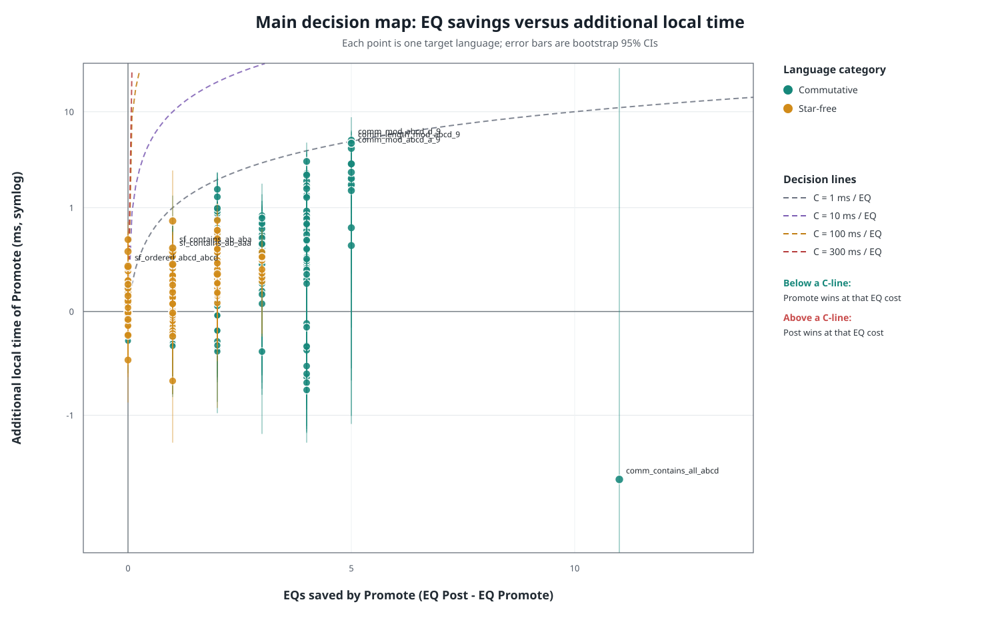
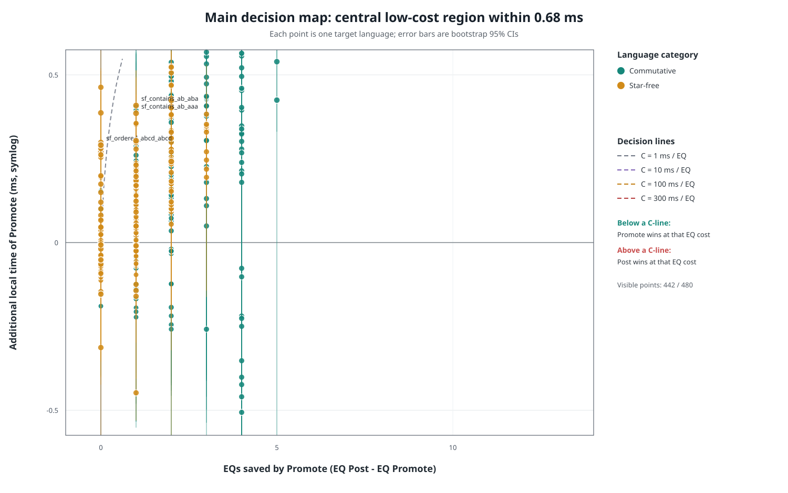

# Post 与 Promote 主决策图实验

实验日期：2026-08-25
代码版本：`8a90c0b + 本次统计修改`
平台：`Windows-11-10.0.26200-SP0`
处理器：`AMD64 Family 25 Model 117 Stepping 2, AuthenticAMD`
Python：`3.14.3`

## 1. 新图表的目的

主决策图不再比较单纯的 EQ 比率和 Cells 比率，而是直接比较 Promote 的收益与代价。每个点代表一个目标语言。

横轴定义为：

$$
\Delta EQ = EQ_{Post}-EQ_{Promote}
$$

它表示 Promote 实际节省了多少次 EQ。点越靠右，Promote 的外部查询优势越大。

纵轴定义为：

$$
\Delta T_{local}=T_{Promote,local}-T_{Post,local}
$$

其中每次运行都直接计算：

$$
T_{local}^{(i)}=T_{total}^{(i)}-T_{EQ}^{(i)}
$$

然后对 local 样本自身取中位数。纵轴大于零表示 Promote 付出了更多本地计算，纵轴小于零表示 Promote 本地计算也更快。

## 2. 决策线与判断规则

假设真实环境中一次 EQ 的平均成本为 $C$ ms，则两种策略的边界是：

$$
\Delta T_{local}=C\,\Delta EQ
$$

图中分别绘制 $C=1,10,100,300$ ms/EQ 的决策线。对于给定的 $C$：

- 点在线下方：Promote 节省的 EQ 成本超过其额外本地成本，Promote 更优。
- 点在线上方：额外本地成本尚未被 EQ 节省抵消，Post 更优。
- 右下象限：Promote 同时减少 EQ 且降低本地时间，Promote 严格占优。
- 左上象限：Promote 同时增加 EQ 和本地时间，Post 严格占优。

单语言盈亏平衡成本定义为：

$$
C^*=\frac{\Delta T_{local}}{\Delta EQ}
$$

当真实 EQ 成本高于 $C^*$ 时 Promote 更合适。$C^*$ 是平台相关的工程指标，不是语言固定不变的理论性质。

## 3. 实验方法

- 两个性质分类共完成 480 个分类用例；其中 100 个语言同时属于 Commutative 和 Star-free，按最小 DFA 去重后共有 380 个不同语言。正式重复次数为：交换语言 15 次, Star-free 语言 15 次。
- 每个分类生成 240 个候选语言；超过 600 秒或验证失败的用例共 0 个，并记录在 `benchmark_data/discarded_cases.json`。
- Commutative 套件覆盖单字母模计数、截断阈值、精确计数、长度模、包含性、模计数直积和阈值直积；每个目标均实际审计 syntactic monoid 的交换性。
- Star-free 套件覆盖阈值/有限计数、首尾判定、固定子串、固定后缀、有限单词和有序块；每个目标均实际审计 syntactic monoid 的 aperiodicity。
- 两个分类是语言性质而不是互斥分区，交集语言在各组中独立计时；组内不存在重复的最小 DFA。
- 每个用例先各预热一次，并在正式测量中交替策略顺序。
- `gc.collect()` 在计时开始前执行；目标 DFA、Oracle 构造和最终额外正确性验证不计入 learner 时间。
- 每次运行保存 total、EQ、local 和 Monoid Check 原始时间样本。
- 表格报告 local 中位数及四分位区间；图中误差棒为独立样本 bootstrap 的中位数差 95% 区间。
- 给定 EQ 成本后，只有误差棒整体位于决策线下方/上方时才分别判为 Promote/Post；误差棒穿过决策线时记为 Inconclusive。
- 所有运行验证最终语言等价、学习状态数等于目标 syntactic monoid 大小，且 Promote 不执行 Monoid Consistency Check。

原始 JSON 位于 [`benchmark_data/`](benchmark_data/)，图位于 [`figures/`](figures/)。

## 4. 一些说明

### 4.1 本轮为何暂不计算 MQ 的外部代价

本轮主决策图只把 EQ 作为可变的外部查询成本，没有把 MQ 次数乘以某个假设的单次 MQ 价格。这样处理不是认为 MQ 永远免费，也不是认为两种策略在所有语言上的 MQ 必然相同，而是因为本轮选取的低到中等复杂度 Commutative 与 Star-free 用例中，两种策略的 MQ 次数在逐语言层面高度接近。

480 个分类用例中，有 402 个用例的 MQ 完全相同，467 个用例的差距不超过 1 次，逐语言绝对差的中位数为 0。最大的异常项 `comm_contains_all_abcd` 为 Post/Promote 10,319/6,954；去掉这一项后，其余 479 个分类用例的 MQ 总数为 63,192/63,203，仅相差 11 次。因此，本轮先把 MQ 视为近似受控变量，集中观察 Promote 节省 EQ 所获得的收益，以及扩大 `P` 和 Cells 带来的本地时间与空间代价。MQ 原始计数仍完整保存在 JSON 和逐语言表格中，并未从实验数据中删除。

这一近似只适用于本轮样本，不能推广为 Commutative 或 Star-free 语言的一般性质。此前的复杂 Commutative 实验包含规模 35 至 99 的计数器组合，单个语言的 MQ 差距曾达到 +30,671 或 -12,432；在那些旧样本中，显著分叉主要出现在多个模计数器或阈值计数器与模计数器的析取组合中。相比之下，本轮 Commutative 的最大 syntactic monoid 只有 16，Star-free 的最大值只有 12。因此，复杂 Commutative 语言中的 MQ 分叉、查询长度和真实 MQ 成本需要在后续实验中按 monoid 规模与构造类型进一步研究。本报告末尾保留了相应的 MQ 成本建模与仿真方案。

### 4.2 本轮实现使用的缓存

按当前代码中的具体容器计算，Learner 侧共有 9 个可复用结构：`query_cache`、`table`、`row_cache`、`suffix_row_cache`、`sorted_p_cache`、`sorted_s_cache`、`sorted_i_cache`、`right_extensions_cache`，以及 Post 在单次 Monoid Check 中创建的局部 `context_cache`。此外还有 3 个增量填表标记；Oracle 侧有 1 个目标 syntactic monoid 预计算缓存。下面按实际调用过程逐项说明。需要注意，`table` 更准确地说是观察表的物化存储；它是否应继续保留的问题单独记录在第 11 节。

#### 4.2.1 `query_cache`：完整字符串的 MQ 总缓存

键是提交给 Teacher 的完整字符串 `w`，值是 `MQ(w)` 的布尔答案。填表、构造接受状态、反例二分和 Monoid Check 的补充查询全部经过 `Learner._ask_teacher(w)`：命中时直接返回；未命中时才调用 `teacher.membership_query(w)`、保存答案并把 `mq_count` 加一。因此实验 JSON 中的 MQ 表示真正到达 Teacher 的唯一字符串数，不是内部读取次数。

例如多个观察表坐标都拼出字符串 `ab` 时，`query_cache` 中仍只有 `query_cache['ab']` 一项。成员关系不会因为 `P`、`I`、`S` 扩张而改变，所以它无需按表结构失效。该字典在 `Learner.__init__()` 中创建，生命周期覆盖整个 Learner 实例；本实验每个计时样本都新建 Learner 且只调用一次 `learn()`，因此不同策略、预热和重复测量之间不共享 MQ 答案。

#### 4.2.2 `table`：三维观察表的物化单元格

键是 `(i,p,s)`，值是 $MQ(pis)$。`_fill_cell(i,p,s)` 只在该三元组尚不存在时调用 `_ask_teacher(p+i+s)`。它让代码能够按理论观察表的坐标构造行、输出 debug 快照、判断哪些行列已填充并用 `len(table)` 统计 Cells。

`table` 和 `query_cache` 的去重层次不同：前者区分结构坐标，后者区分最终字符串。`(i='ab',p='',s='')` 与 `(i='b',p='a',s='')` 都查询 `ab`，所以 table 中有两个 Cells，而 `query_cache` 中只有一个 MQ。`P`、`I`、`S` 扩张时，旧单元格不会失效，table 只继续增长。本结构主要提供观察表物化和实现便利，并不进一步减少真实 MQ；第 11 节给出了删除它的静态分析和原型验证。

#### 4.2.3 `row_cache`：当前 $P\times S$ 下的完整状态行

键是字符串 `i`，值是按稳定的 `P`、`S` 顺序组成的布尔元组：

$$
row(i)=\big(MQ(pis)\big)_{p\in P,\,s\in S}.
$$

例如 `P={ε,a}`、`S={ε,b}` 时，`row_cache['a']` 保存由 $MQ(a)$、$MQ(ab)$、$MQ(aa)$、$MQ(aab)$ 组成的整行。它不减少 Teacher MQ，而是避免 closed 检查、代表元选择、状态映射、转移构造和 Monoid Check 准备阶段反复遍历 $P\times S$、拼接字符串并重新组装同一个元组。

只要 `P` 或 `S` 改变，行的坐标或维度就改变，`row_cache` 必须整体清空；`I` 增加只会带来新的行，不改变旧字符串的行，因此无需清空旧缓存。删除三维 table 后，`row_cache` 仍然有明确价值，并会成为 `query_cache` 之上的主要结构缓存。

#### 4.2.4 `suffix_row_cache`：right consistency 使用的经典后缀行

键同样是 `i`，值只包含空左语境下的经典 L-star 行：

$$
row_S(i)=\big(MQ(is)\big)_{s\in S}.
$$

right consistency 先比较两个 `I` 元素的 `row_S`，再比较它们右接字母后的 `row_S`，因此同一行会在状态对和字母循环中被反复读取。该缓存避免重复组装这些后缀向量。它只依赖 `S`：新增 `S` 时整体清空；新增 `P` 不改变经典后缀行，所以不应清空；新增 `I` 也不影响已经存在的行。

#### 4.2.5 `sorted_p_cache`：P 的稳定遍历顺序

值是 `tuple(sorted(P))`。`P` 本身是集合，直接遍历没有适合行向量比较的稳定顺序；缓存后的元组既避免在多层循环里反复排序，也保证所有 `row(i)` 使用完全相同的坐标顺序。它在 `P` 改变时置为 `None`，下一次读取时重建。Promote 会频繁把 `I` 代表元加入 `P`，因此该缓存及完整 `row_cache` 在 Promote 中通常比 Post 更频繁失效。

#### 4.2.6 `sorted_s_cache`：S 的稳定遍历顺序

值是 `tuple(sorted(S))`，用于完整 row、经典后缀 row、right consistency 和 Monoid Check。它保证不同字符串的第 k 个行分量始终对应同一个后缀。只在 `S` 新增区分后缀时失效；`P` 或 `I` 的变化不会影响它。

#### 4.2.7 `sorted_i_cache`：I 的稳定代表元顺序

值是按“先字符串长度、后字典序”排列的 `I` 元组。它用于枚举 right consistency 的状态对、建立 row 到代表元的映射、枚举 Monoid Check 左语境，并使同一 row 优先选择较短且可复现的代表串。只在 `I` 增加新元素时失效；`P`、`S` 改变会改变 row 的内容，但不会改变 `I` 自身的排序。

#### 4.2.8 `right_extensions_cache`：边界集合 $I\cdot\Sigma$

值是集合 $\{ia\mid i\in I,a\in\Sigma\}$。它定义 observation table 的 lower rows，也是 closed 检查和 debug 表格边界部分的输入。构造这一集合需要遍历全部 `I` 和字母表，因此在多个阶段复用。它只依赖 `I` 和固定字母表：`I` 改变时失效，`P` 或 `S` 改变时保持有效。

#### 4.2.9 `context_cache`：Post 单次 Monoid Check 的语境缓存

每次 `ensure_monoid_consistency()` 都创建一个新的局部字典，键是 `(left,middle,suffix)`，值是 $MQ(left\,middle\,suffix)$。它在同一轮检查多个边界与代表元时复用已经计算的语境答案。读取顺序是：先查该局部字典，再尝试已有 table 单元格或移位后的 $p=\varepsilon$ 单元格，最后才进入全局 `query_cache`/Teacher。

如果检查找到不一致并把新的左语境加入 `P`，本轮立即结束；下一次 Monoid Check 会重建 `context_cache`，因为检查阶段和候选关系已经改变。不过真实 MQ 答案仍保留在全局 `query_cache` 中。Promote 不执行 Monoid Consistency Check，因此完全不创建这一局部缓存。

#### 4.2.10 Oracle 的目标 monoid 预计算缓存

Oracle 构造时从最小目标 DFA 计算一次 `target_monoid_size` 和 `target_monoid_elements`。本实验用它审计 Commutative 的交换性、Star-free 的 aperiodicity，并验证最终学习状态数。该计算发生在 learner 计时之外；同一语言的两种策略、预热和正式重复共用同一个 Oracle，所以不会重复生成目标 monoid。

它不缓存 MQ 或 EQ 答案：`membership_query(w)` 仍由目标 DFA 判定；每次 EQ 仍重新计算目标与假设的对称差。

#### 4.2.11 三个增量填表标记

- `filled_rows` 记录已经按当时 $P\times S$ 填过的 `I\cup I\Sigma` 行；新增 `I` 后只识别并填充新行。
- `processed_P` 保存上次填表结束时的 `P`；下一轮通过 `P-processed_P` 找到新左语境，只补对应的新列。
- `processed_S` 保存上次填表结束时的 `S`；下一轮通过 `S-processed_S` 找到新区分后缀，只补对应的新列。

这三个集合不保存 MQ 答案，而是维护物化 table 的增量进度。如果第 11 节提出的 table 删除方案实施，它们和五个填表辅助方法也可以一起删除。

#### 4.2.12 不属于结果缓存的结构

`state_to_rep` 保存假设状态名到代表字符串的语义映射，供反例轨迹定位使用，不是性能缓存。EQ 也没有跨轮缓存：每次都重新构造对称差并用 BFS 找最短反例，BFS 的 `visited` 只在当前一次 EQ 内存在。Post 和 Promote 共同使用 `query_cache`、row/suffix row、排序视图和右扩展缓存；Promote 额外扩大物化 table，Post 则独有单轮 `context_cache`。因此缓存结构会影响本地时间和空间，但不会改变 Teacher 的语言答案。

## 5. 分组汇总

| Group | Cases | Alphabet sizes | Σ Local median ms Post/Promote | ΔLocal ms | EQ Post/Promote | ΔEQ | Group C* ms/EQ | Cells Post/Promote |
|---|---:|---|---:|---:|---:|---:|---:|---:|
| 交换语言 | 240 | 1, 2, 3, 4 | 385.34/462.90 | 77.57 | 984/474 | 510 | 0.152 | 19,560/129,938 |
| Star-free 语言 | 240 | 1, 2, 3, 4 | 173.68/191.42 | 17.74 | 741/540 | 201 | 0.088 | 22,201/84,267 |
| 合计 | 480 | 1, 2, 3, 4 | 559.01/654.32 | 95.31 | 1725/1014 | 711 | 0.134 | 41,761/214,205 |

### 5.1 按字母表大小分层

字母表大小不再作为独立语言组，而是作为所有语言共有的实验维度。

| Group | Alphabet size | Cases | Σ Local median ms Post/Promote | ΔLocal ms | EQ Post/Promote | ΔEQ | Cells Post/Promote |
|---|---:|---:|---:|---:|---:|---:|---:|
| 交换语言 | 1 | 18 | 7.623/9.752 | 2.129 | 71/38 | 33 | 491/3,150 |
| Star-free 语言 | 1 | 15 | 4.625/5.327 | 0.702 | 50/33 | 17 | 300/1,590 |
| 合计 | 1 | 33 | 12.25/15.08 | 2.831 | 121/71 | 50 | 791/4,740 |
| 交换语言 | 2 | 49 | 51.98/61.61 | 9.625 | 199/100 | 99 | 2,587/16,866 |
| Star-free 语言 | 2 | 57 | 32.04/35.62 | 3.587 | 175/131 | 44 | 3,850/14,695 |
| 合计 | 2 | 106 | 84.02/97.23 | 13.21 | 374/231 | 143 | 6,437/31,561 |
| 交换语言 | 3 | 73 | 100.58/126.13 | 25.55 | 298/144 | 154 | 5,650/36,534 |
| Star-free 语言 | 3 | 77 | 53.58/57.98 | 4.405 | 234/173 | 61 | 6,811/25,212 |
| 合计 | 3 | 150 | 154.16/184.11 | 29.96 | 532/317 | 215 | 12,461/61,746 |
| 交换语言 | 4 | 100 | 225.15/265.41 | 40.26 | 416/192 | 224 | 10,832/73,388 |
| Star-free 语言 | 4 | 91 | 83.44/92.49 | 9.049 | 282/203 | 79 | 11,240/42,770 |
| 合计 | 4 | 191 | 308.59/357.90 | 49.31 | 698/395 | 303 | 22,072/116,158 |

## 6. 不同 EQ 成本下的策略选择

| Assumed real EQ cost | Promote languages | Post languages | Inconclusive |
|---:|---:|---:|---:|
| 1 ms/EQ | 338 | 10 | 132 |
| 10 ms/EQ | 352 | 10 | 118 |
| 100 ms/EQ | 352 | 10 | 118 |
| 300 ms/EQ | 352 | 10 | 118 |

这一表格只代入 EQ 成本，暂时把 MQ 的外部成本视为相同或可忽略。若真实 MQ 也昂贵，应进一步加入 $\Delta MQ\cdot C_{MQ}$。Inconclusive 表示 bootstrap 95% 区间与决策线相交，并不表示两种策略已被证明等价。

## 7. 各语言统计数据

`Local IQR` 为 `[Q1, Q3]`；`ΔEQ` 为 Post 减 Promote；`ΔLocal` 为 Promote 减 Post。

### 7.1 交换语言

| Case | Alphabet | Alphabet size | DFA | Monoid | Total ms Post/Promote | Local ms Post/Promote | Local IQR Post/Promote | EQ Post/Promote | ΔEQ | ΔLocal ms | C* ms/EQ | MQ Post/Promote | Cells Post/Promote |
|---|---|---:|---:|---:|---:|---:|---:|---:|---:|---:|---:|---:|---:|
| `comm_mod_a_a_2` | `a` | 1 | 2 | 2 | 0.237/0.241 | 0.136/0.141 | [0.132, 0.159]/[0.130, 0.168] | 1/1 | 0 | 0.005 | no finite threshold | 4/4 | 3/6 |
| `comm_mod_a_a_3` | `a` | 1 | 3 | 3 | 0.362/0.294 | 0.195/0.182 | [0.189, 0.247]/[0.179, 0.216] | 2/1 | 1 | -0.013 | ≤ 0 | 7/7 | 8/24 |
| `comm_mod_a_a_4` | `a` | 1 | 4 | 4 | 0.518/0.570 | 0.261/0.335 | [0.238, 0.392]/[0.279, 0.396] | 3/2 | 1 | 0.073 | 0.073 | 10/10 | 15/60 |
| `comm_mod_a_a_5` | `a` | 1 | 5 | 5 | 0.682/0.541 | 0.338/0.364 | [0.325, 0.385]/[0.359, 0.374] | 4/2 | 2 | 0.026 | 0.013 | 13/14 | 24/120 |
| `comm_mod_a_a_6` | `a` | 1 | 6 | 6 | 1.089/1.163 | 0.621/0.949 | [0.579, 0.703]/[0.930, 1.030] | 5/2 | 3 | 0.328 | 0.109 | 16/17 | 35/210 |
| `comm_mod_a_a_7` | `a` | 1 | 7 | 7 | 1.401/1.230 | 0.626/0.938 | [0.548, 0.733]/[0.798, 1.050] | 6/2 | 4 | 0.312 | 0.078 | 19/20 | 48/336 |
| `comm_mod_a_a_8` | `a` | 1 | 8 | 8 | 1.862/1.501 | 0.842/1.090 | [0.714, 1.034]/[1.002, 1.502] | 7/3 | 4 | 0.248 | 0.062 | 22/23 | 63/504 |
| `comm_mod_a_a_9` | `a` | 1 | 9 | 9 | 2.194/1.879 | 0.911/1.502 | [0.829, 1.227]/[1.374, 1.703] | 8/3 | 5 | 0.591 | 0.118 | 25/26 | 80/720 |
| `comm_at_least_a_a_1` | `a` | 1 | 2 | 2 | 0.260/0.243 | 0.148/0.140 | [0.118, 0.196]/[0.120, 0.166] | 1/1 | 0 | -0.008 | Promote dominates | 4/4 | 3/6 |
| `comm_at_least_a_a_2` | `a` | 1 | 3 | 3 | 0.390/0.399 | 0.210/0.224 | [0.197, 0.233]/[0.195, 0.297] | 2/2 | 0 | 0.014 | no finite threshold | 7/7 | 8/24 |
| `comm_at_least_a_a_3` | `a` | 1 | 4 | 4 | 0.534/0.488 | 0.280/0.289 | [0.246, 0.341]/[0.244, 0.389] | 3/2 | 1 | 0.009 | 0.009 | 10/10 | 15/60 |
| `comm_at_least_a_a_4` | `a` | 1 | 5 | 5 | 0.925/0.874 | 0.454/0.520 | [0.351, 0.486]/[0.396, 0.659] | 4/3 | 1 | 0.066 | 0.066 | 13/13 | 24/120 |
| `comm_at_least_a_a_5` | `a` | 1 | 6 | 6 | 1.047/1.057 | 0.518/0.682 | [0.427, 0.667]/[0.539, 0.812] | 5/3 | 2 | 0.164 | 0.082 | 16/16 | 35/210 |
| `comm_at_least_a_a_6` | `a` | 1 | 7 | 7 | 1.088/1.146 | 0.566/0.771 | [0.488, 0.687]/[0.701, 0.959] | 6/4 | 2 | 0.206 | 0.103 | 19/19 | 48/336 |
| `comm_exact_a_a_1` | `a` | 1 | 3 | 3 | 0.390/0.302 | 0.215/0.196 | [0.195, 0.277]/[0.176, 0.249] | 2/1 | 1 | -0.019 | ≤ 0 | 7/7 | 8/24 |
| `comm_exact_a_a_2` | `a` | 1 | 4 | 4 | 0.580/0.557 | 0.297/0.321 | [0.277, 0.377]/[0.281, 0.355] | 3/2 | 1 | 0.025 | 0.025 | 10/10 | 15/60 |
| `comm_exact_a_a_3` | `a` | 1 | 5 | 5 | 0.723/0.566 | 0.367/0.380 | [0.344, 0.437]/[0.371, 0.395] | 4/2 | 2 | 0.013 | 0.007 | 13/13 | 24/120 |
| `comm_exact_a_a_4` | `a` | 1 | 6 | 6 | 1.314/1.004 | 0.638/0.728 | [0.479, 0.773]/[0.634, 0.896] | 5/2 | 3 | 0.090 | 0.030 | 16/16 | 35/210 |
| `comm_mod_ab_a_2` | `ab` | 2 | 2 | 2 | 0.369/0.354 | 0.217/0.206 | [0.171, 0.234]/[0.195, 0.214] | 1/1 | 0 | -0.011 | Promote dominates | 7/7 | 5/10 |
| `comm_mod_ab_a_3` | `ab` | 2 | 3 | 3 | 0.472/0.353 | 0.265/0.239 | [0.259, 0.391]/[0.237, 0.260] | 2/1 | 1 | -0.026 | ≤ 0 | 17/17 | 14/42 |
| `comm_mod_ab_a_4` | `ab` | 2 | 4 | 4 | 1.075/0.993 | 0.591/0.647 | [0.569, 0.839]/[0.545, 0.756] | 3/2 | 1 | 0.056 | 0.056 | 31/31 | 27/108 |
| `comm_mod_ab_a_5` | `ab` | 2 | 5 | 5 | 1.114/1.150 | 0.606/0.830 | [0.571, 0.736]/[0.607, 0.898] | 4/2 | 2 | 0.225 | 0.112 | 49/50 | 44/220 |
| `comm_mod_ab_a_6` | `ab` | 2 | 6 | 6 | 2.201/2.351 | 1.335/1.820 | [1.063, 1.608]/[1.326, 2.085] | 5/2 | 3 | 0.485 | 0.162 | 71/72 | 65/390 |
| `comm_mod_ab_a_7` | `ab` | 2 | 7 | 7 | 3.307/2.529 | 1.870/2.087 | [1.257, 2.196]/[1.771, 2.444] | 6/2 | 4 | 0.216 | 0.054 | 97/98 | 90/630 |
| `comm_mod_ab_a_8` | `ab` | 2 | 8 | 8 | 3.303/3.068 | 1.921/2.573 | [1.454, 2.318]/[2.076, 3.073] | 7/3 | 4 | 0.653 | 0.163 | 127/128 | 119/952 |
| `comm_mod_ab_a_9` | `ab` | 2 | 9 | 9 | 5.225/5.564 | 2.862/4.527 | [2.008, 3.873]/[3.114, 5.639] | 8/3 | 5 | 1.665 | 0.333 | 161/162 | 152/1,368 |
| `comm_at_least_ab_a_1` | `ab` | 2 | 2 | 2 | 0.399/0.405 | 0.227/0.225 | [0.208, 0.272]/[0.205, 0.236] | 1/1 | 0 | -0.003 | Promote dominates | 7/7 | 5/10 |
| `comm_at_least_ab_a_2` | `ab` | 2 | 3 | 3 | 0.757/0.687 | 0.415/0.345 | [0.314, 0.570]/[0.310, 0.402] | 2/2 | 0 | -0.070 | Promote dominates | 17/17 | 14/42 |
| `comm_at_least_ab_a_3` | `ab` | 2 | 4 | 4 | 1.147/0.973 | 0.596/0.588 | [0.541, 1.295]/[0.530, 0.845] | 3/2 | 1 | -0.008 | ≤ 0 | 31/31 | 27/108 |
| `comm_at_least_ab_a_4` | `ab` | 2 | 5 | 5 | 1.098/0.948 | 0.646/0.614 | [0.538, 0.692]/[0.582, 0.855] | 4/3 | 1 | -0.031 | ≤ 0 | 49/49 | 44/220 |
| `comm_at_least_ab_a_5` | `ab` | 2 | 6 | 6 | 1.799/1.901 | 1.045/1.428 | [0.962, 1.171]/[0.972, 1.572] | 5/3 | 2 | 0.383 | 0.191 | 71/71 | 65/390 |
| `comm_at_least_ab_a_6` | `ab` | 2 | 7 | 7 | 2.657/2.738 | 1.665/1.956 | [1.363, 1.751]/[1.923, 2.325] | 6/4 | 2 | 0.292 | 0.146 | 97/97 | 90/630 |
| `comm_exact_ab_a_1` | `ab` | 2 | 3 | 3 | 0.752/0.578 | 0.399/0.411 | [0.361, 0.454]/[0.326, 0.474] | 2/1 | 1 | 0.012 | 0.012 | 17/17 | 14/42 |
| `comm_exact_ab_a_2` | `ab` | 2 | 4 | 4 | 0.910/0.820 | 0.540/0.534 | [0.396, 0.608]/[0.427, 0.590] | 3/2 | 1 | -0.006 | ≤ 0 | 31/31 | 27/108 |
| `comm_exact_ab_a_3` | `ab` | 2 | 5 | 5 | 1.656/1.352 | 0.940/1.001 | [0.902, 1.047]/[0.899, 1.487] | 4/2 | 2 | 0.061 | 0.031 | 49/49 | 44/220 |
| `comm_exact_ab_a_4` | `ab` | 2 | 6 | 6 | 1.807/1.598 | 1.078/1.277 | [0.841, 1.161]/[0.924, 1.470] | 5/2 | 3 | 0.198 | 0.066 | 71/71 | 65/390 |
| `comm_mod_ab_b_2` | `ab` | 2 | 2 | 2 | 0.422/0.392 | 0.252/0.212 | [0.219, 0.288]/[0.202, 0.249] | 1/1 | 0 | -0.039 | Promote dominates | 7/7 | 5/10 |
| `comm_mod_ab_b_3` | `ab` | 2 | 3 | 3 | 0.703/0.559 | 0.387/0.378 | [0.306, 0.429]/[0.253, 0.424] | 2/1 | 1 | -0.009 | ≤ 0 | 17/17 | 14/42 |
| `comm_mod_ab_b_4` | `ab` | 2 | 4 | 4 | 0.711/0.653 | 0.394/0.426 | [0.383, 0.506]/[0.399, 0.541] | 3/2 | 1 | 0.032 | 0.032 | 31/31 | 27/108 |
| `comm_mod_ab_b_5` | `ab` | 2 | 5 | 5 | 1.918/1.535 | 1.100/1.092 | [0.908, 1.290]/[1.000, 1.488] | 4/2 | 2 | -0.007 | ≤ 0 | 49/50 | 44/220 |
| `comm_mod_ab_b_6` | `ab` | 2 | 6 | 6 | 1.701/1.339 | 0.985/1.045 | [0.906, 1.243]/[0.872, 1.455] | 5/2 | 3 | 0.060 | 0.020 | 71/72 | 65/390 |
| `comm_mod_ab_b_7` | `ab` | 2 | 7 | 7 | 3.220/3.087 | 1.762/2.626 | [1.633, 2.199]/[2.131, 3.381] | 6/2 | 4 | 0.864 | 0.216 | 97/98 | 90/630 |
| `comm_mod_ab_b_8` | `ab` | 2 | 8 | 8 | 2.464/2.340 | 1.532/1.940 | [1.346, 1.767]/[1.825, 2.345] | 7/3 | 4 | 0.409 | 0.102 | 127/128 | 119/952 |
| `comm_mod_ab_b_9` | `ab` | 2 | 9 | 9 | 7.327/6.279 | 4.633/4.991 | [3.011, 6.067]/[4.271, 6.486] | 8/3 | 5 | 0.358 | 0.072 | 161/162 | 152/1,368 |
| `comm_at_least_ab_b_1` | `ab` | 2 | 2 | 2 | 0.369/0.369 | 0.220/0.215 | [0.200, 0.260]/[0.196, 0.232] | 1/1 | 0 | -0.004 | Promote dominates | 7/7 | 5/10 |
| `comm_at_least_ab_b_2` | `ab` | 2 | 3 | 3 | 0.651/0.789 | 0.345/0.419 | [0.326, 0.367]/[0.373, 0.503] | 2/2 | 0 | 0.074 | no finite threshold | 17/17 | 14/42 |
| `comm_at_least_ab_b_3` | `ab` | 2 | 4 | 4 | 1.117/1.013 | 0.608/0.606 | [0.435, 0.689]/[0.521, 1.101] | 3/2 | 1 | -0.003 | ≤ 0 | 31/31 | 27/108 |
| `comm_at_least_ab_b_4` | `ab` | 2 | 5 | 5 | 1.277/1.367 | 0.734/0.808 | [0.478, 1.031]/[0.576, 0.985] | 4/3 | 1 | 0.074 | 0.074 | 49/49 | 44/220 |
| `comm_at_least_ab_b_5` | `ab` | 2 | 6 | 6 | 1.860/2.065 | 1.072/1.435 | [0.998, 1.247]/[1.267, 1.658] | 5/3 | 2 | 0.362 | 0.181 | 71/71 | 65/390 |
| `comm_at_least_ab_b_6` | `ab` | 2 | 7 | 7 | 2.984/3.037 | 1.749/2.244 | [1.529, 1.909]/[2.018, 2.791] | 6/4 | 2 | 0.494 | 0.247 | 97/97 | 90/630 |
| `comm_exact_ab_b_1` | `ab` | 2 | 3 | 3 | 0.677/0.499 | 0.386/0.328 | [0.330, 0.422]/[0.299, 0.485] | 2/1 | 1 | -0.058 | ≤ 0 | 17/17 | 14/42 |
| `comm_exact_ab_b_2` | `ab` | 2 | 4 | 4 | 0.959/0.846 | 0.530/0.525 | [0.351, 0.667]/[0.419, 0.637] | 3/2 | 1 | -0.005 | ≤ 0 | 31/31 | 27/108 |
| `comm_exact_ab_b_3` | `ab` | 2 | 5 | 5 | 0.881/0.807 | 0.513/0.585 | [0.493, 0.681]/[0.545, 0.843] | 4/2 | 2 | 0.072 | 0.036 | 49/49 | 44/220 |
| `comm_exact_ab_b_4` | `ab` | 2 | 6 | 6 | 2.216/2.066 | 1.222/1.583 | [1.085, 1.571]/[1.447, 2.142] | 5/2 | 3 | 0.361 | 0.120 | 71/71 | 65/390 |
| `comm_mod_abc_a_2` | `abc` | 3 | 2 | 2 | 0.441/0.396 | 0.257/0.231 | [0.233, 0.276]/[0.220, 0.269] | 1/1 | 0 | -0.027 | Promote dominates | 10/10 | 7/14 |
| `comm_mod_abc_a_3` | `abc` | 3 | 3 | 3 | 0.891/0.601 | 0.509/0.408 | [0.471, 0.911]/[0.382, 0.481] | 2/1 | 1 | -0.101 | ≤ 0 | 27/27 | 20/60 |
| `comm_mod_abc_a_4` | `abc` | 3 | 4 | 4 | 0.902/0.680 | 0.548/0.467 | [0.467, 0.635]/[0.457, 0.633] | 3/2 | 1 | -0.081 | ≤ 0 | 52/52 | 39/156 |
| `comm_mod_abc_a_5` | `abc` | 3 | 5 | 5 | 1.559/1.115 | 0.889/0.833 | [0.674, 1.111]/[0.710, 1.221] | 4/2 | 2 | -0.056 | ≤ 0 | 85/86 | 64/320 |
| `comm_mod_abc_a_6` | `abc` | 3 | 6 | 6 | 2.409/2.378 | 1.485/1.930 | [1.417, 1.838]/[1.633, 2.297] | 5/2 | 3 | 0.445 | 0.148 | 126/127 | 95/570 |
| `comm_mod_abc_a_7` | `abc` | 3 | 7 | 7 | 4.738/3.912 | 2.734/3.281 | [2.336, 3.024]/[3.020, 3.905] | 6/2 | 4 | 0.547 | 0.137 | 175/176 | 132/924 |
| `comm_mod_abc_a_8` | `abc` | 3 | 8 | 8 | 6.063/6.184 | 3.342/5.276 | [2.853, 4.802]/[4.434, 6.335] | 7/3 | 4 | 1.935 | 0.484 | 232/233 | 175/1,400 |
| `comm_mod_abc_a_9` | `abc` | 3 | 9 | 9 | 8.319/8.511 | 4.633/7.556 | [4.076, 5.466]/[6.103, 8.326] | 8/3 | 5 | 2.924 | 0.585 | 297/298 | 224/2,016 |
| `comm_at_least_abc_a_1` | `abc` | 3 | 2 | 2 | 0.410/0.405 | 0.250/0.235 | [0.227, 0.285]/[0.212, 0.273] | 1/1 | 0 | -0.015 | Promote dominates | 10/10 | 7/14 |
| `comm_at_least_abc_a_2` | `abc` | 3 | 3 | 3 | 0.633/0.620 | 0.361/0.361 | [0.272, 0.383]/[0.321, 0.389] | 2/2 | 0 | 0.000001 | no finite threshold | 27/27 | 20/60 |
| `comm_at_least_abc_a_3` | `abc` | 3 | 4 | 4 | 1.039/1.035 | 0.592/0.703 | [0.483, 0.668]/[0.607, 1.277] | 3/2 | 1 | 0.111 | 0.111 | 52/52 | 39/156 |
| `comm_at_least_abc_a_4` | `abc` | 3 | 5 | 5 | 2.055/1.716 | 1.126/1.181 | [0.918, 1.327]/[1.097, 1.372] | 4/3 | 1 | 0.054 | 0.054 | 85/85 | 64/320 |
| `comm_at_least_abc_a_5` | `abc` | 3 | 6 | 6 | 1.884/1.719 | 1.181/1.218 | [1.021, 1.342]/[1.116, 1.837] | 5/3 | 2 | 0.037 | 0.018 | 126/126 | 95/570 |
| `comm_at_least_abc_a_6` | `abc` | 3 | 7 | 7 | 2.636/3.533 | 1.750/2.756 | [1.421, 2.290]/[2.082, 3.571] | 6/4 | 2 | 1.007 | 0.503 | 175/175 | 132/924 |
| `comm_exact_abc_a_1` | `abc` | 3 | 3 | 3 | 0.803/0.634 | 0.454/0.433 | [0.408, 0.501]/[0.394, 0.557] | 2/1 | 1 | -0.022 | ≤ 0 | 27/27 | 20/60 |
| `comm_exact_abc_a_2` | `abc` | 3 | 4 | 4 | 1.236/1.238 | 0.735/0.749 | [0.628, 0.793]/[0.679, 0.898] | 3/2 | 1 | 0.014 | 0.014 | 52/52 | 39/156 |
| `comm_exact_abc_a_3` | `abc` | 3 | 5 | 5 | 1.096/1.109 | 0.673/0.828 | [0.646, 0.960]/[0.748, 1.008] | 4/2 | 2 | 0.154 | 0.077 | 85/85 | 64/320 |
| `comm_exact_abc_a_4` | `abc` | 3 | 6 | 6 | 2.380/2.494 | 1.477/2.108 | [1.147, 1.828]/[1.624, 2.460] | 5/2 | 3 | 0.631 | 0.210 | 126/126 | 95/570 |
| `comm_mod_abc_b_2` | `abc` | 3 | 2 | 2 | 0.433/0.420 | 0.262/0.244 | [0.226, 0.321]/[0.219, 0.274] | 1/1 | 0 | -0.017 | Promote dominates | 10/10 | 7/14 |
| `comm_mod_abc_b_3` | `abc` | 3 | 3 | 3 | 0.731/0.576 | 0.426/0.409 | [0.339, 0.507]/[0.374, 0.522] | 2/1 | 1 | -0.017 | ≤ 0 | 27/27 | 20/60 |
| `comm_mod_abc_b_4` | `abc` | 3 | 4 | 4 | 1.119/1.055 | 0.635/0.714 | [0.599, 0.737]/[0.589, 0.817] | 3/2 | 1 | 0.079 | 0.079 | 52/52 | 39/156 |
| `comm_mod_abc_b_5` | `abc` | 3 | 5 | 5 | 1.915/2.227 | 1.102/1.609 | [0.939, 1.173]/[1.083, 2.889] | 4/2 | 2 | 0.507 | 0.254 | 85/86 | 64/320 |
| `comm_mod_abc_b_6` | `abc` | 3 | 6 | 6 | 2.193/2.141 | 1.400/1.731 | [1.158, 1.662]/[1.551, 2.071] | 5/2 | 3 | 0.331 | 0.110 | 126/127 | 95/570 |
| `comm_mod_abc_b_7` | `abc` | 3 | 7 | 7 | 3.902/3.697 | 2.350/3.129 | [1.925, 2.925]/[2.548, 3.943] | 6/2 | 4 | 0.780 | 0.195 | 175/176 | 132/924 |
| `comm_mod_abc_b_8` | `abc` | 3 | 8 | 8 | 5.533/5.652 | 3.546/4.894 | [3.137, 3.961]/[4.474, 5.712] | 7/3 | 4 | 1.348 | 0.337 | 232/233 | 175/1,400 |
| `comm_mod_abc_b_9` | `abc` | 3 | 9 | 9 | 5.478/6.995 | 3.271/6.197 | [2.844, 5.259]/[4.770, 7.244] | 8/3 | 5 | 2.926 | 0.585 | 297/298 | 224/2,016 |
| `comm_at_least_abc_b_1` | `abc` | 3 | 2 | 2 | 0.421/0.372 | 0.255/0.220 | [0.244, 0.296]/[0.206, 0.233] | 1/1 | 0 | -0.036 | Promote dominates | 10/10 | 7/14 |
| `comm_at_least_abc_b_2` | `abc` | 3 | 3 | 3 | 0.649/0.684 | 0.371/0.387 | [0.330, 0.395]/[0.302, 0.454] | 2/2 | 0 | 0.016 | no finite threshold | 27/27 | 20/60 |
| `comm_at_least_abc_b_3` | `abc` | 3 | 4 | 4 | 1.221/1.170 | 0.731/0.743 | [0.627, 0.819]/[0.669, 1.016] | 3/2 | 1 | 0.012 | 0.012 | 52/52 | 39/156 |
| `comm_at_least_abc_b_4` | `abc` | 3 | 5 | 5 | 2.048/2.087 | 1.180/1.334 | [0.995, 1.308]/[1.233, 1.812] | 4/3 | 1 | 0.154 | 0.154 | 85/85 | 64/320 |
| `comm_at_least_abc_b_5` | `abc` | 3 | 6 | 6 | 1.624/1.911 | 0.994/1.454 | [0.893, 1.228]/[1.159, 1.695] | 5/3 | 2 | 0.460 | 0.230 | 126/126 | 95/570 |
| `comm_at_least_abc_b_6` | `abc` | 3 | 7 | 7 | 3.444/3.785 | 2.219/2.963 | [1.693, 2.584]/[2.426, 3.652] | 6/4 | 2 | 0.745 | 0.372 | 175/175 | 132/924 |
| `comm_exact_abc_b_1` | `abc` | 3 | 3 | 3 | 0.837/0.628 | 0.487/0.478 | [0.422, 0.630]/[0.408, 0.507] | 2/1 | 1 | -0.009 | ≤ 0 | 27/27 | 20/60 |
| `comm_exact_abc_b_2` | `abc` | 3 | 4 | 4 | 1.165/1.179 | 0.716/0.757 | [0.541, 0.796]/[0.648, 1.093] | 3/2 | 1 | 0.040 | 0.040 | 52/52 | 39/156 |
| `comm_exact_abc_b_3` | `abc` | 3 | 5 | 5 | 1.748/1.504 | 1.068/1.120 | [0.727, 1.245]/[0.923, 1.246] | 4/2 | 2 | 0.052 | 0.026 | 85/85 | 64/320 |
| `comm_exact_abc_b_4` | `abc` | 3 | 6 | 6 | 3.351/2.686 | 1.841/2.206 | [1.475, 2.590]/[1.954, 2.571] | 5/2 | 3 | 0.365 | 0.122 | 126/126 | 95/570 |
| `comm_mod_abc_c_2` | `abc` | 3 | 2 | 2 | 0.421/0.434 | 0.240/0.259 | [0.229, 0.261]/[0.238, 0.323] | 1/1 | 0 | 0.019 | no finite threshold | 10/10 | 7/14 |
| `comm_mod_abc_c_3` | `abc` | 3 | 3 | 3 | 0.506/0.416 | 0.306/0.294 | [0.281, 0.356]/[0.269, 0.391] | 2/1 | 1 | -0.011 | ≤ 0 | 27/27 | 20/60 |
| `comm_mod_abc_c_4` | `abc` | 3 | 4 | 4 | 0.915/0.823 | 0.543/0.552 | [0.481, 0.694]/[0.488, 0.697] | 3/2 | 1 | 0.008 | 0.008 | 52/52 | 39/156 |
| `comm_mod_abc_c_5` | `abc` | 3 | 5 | 5 | 2.031/2.035 | 1.155/1.432 | [1.095, 1.301]/[1.251, 1.663] | 4/2 | 2 | 0.277 | 0.139 | 85/86 | 64/320 |
| `comm_mod_abc_c_6` | `abc` | 3 | 6 | 6 | 2.509/1.870 | 1.557/1.576 | [1.186, 1.795]/[1.306, 2.268] | 5/2 | 3 | 0.019 | 0.006 | 126/127 | 95/570 |
| `comm_mod_abc_c_7` | `abc` | 3 | 7 | 7 | 3.825/2.732 | 2.136/2.331 | [1.600, 2.694]/[1.942, 3.308] | 6/2 | 4 | 0.195 | 0.049 | 175/176 | 132/924 |
| `comm_mod_abc_c_8` | `abc` | 3 | 8 | 8 | 5.871/5.586 | 3.501/4.860 | [2.472, 3.894]/[4.011, 5.811] | 7/3 | 4 | 1.360 | 0.340 | 232/233 | 175/1,400 |
| `comm_mod_abc_c_9` | `abc` | 3 | 9 | 9 | 5.908/6.530 | 3.826/5.812 | [3.076, 4.184]/[4.788, 6.601] | 8/3 | 5 | 1.987 | 0.397 | 297/298 | 224/2,016 |
| `comm_at_least_abc_c_1` | `abc` | 3 | 2 | 2 | 0.457/0.396 | 0.252/0.237 | [0.235, 0.282]/[0.230, 0.251] | 1/1 | 0 | -0.015 | Promote dominates | 10/10 | 7/14 |
| `comm_at_least_abc_c_2` | `abc` | 3 | 3 | 3 | 0.763/0.763 | 0.407/0.449 | [0.361, 0.501]/[0.389, 0.660] | 2/2 | 0 | 0.042 | no finite threshold | 27/27 | 20/60 |
| `comm_at_least_abc_c_3` | `abc` | 3 | 4 | 4 | 1.184/1.029 | 0.702/0.681 | [0.413, 0.829]/[0.472, 0.784] | 3/2 | 1 | -0.022 | ≤ 0 | 52/52 | 39/156 |
| `comm_at_least_abc_c_4` | `abc` | 3 | 5 | 5 | 1.438/1.469 | 0.886/1.026 | [0.600, 1.130]/[0.902, 1.312] | 4/3 | 1 | 0.139 | 0.139 | 85/85 | 64/320 |
| `comm_at_least_abc_c_5` | `abc` | 3 | 6 | 6 | 2.770/2.631 | 1.806/1.931 | [1.492, 2.096]/[1.603, 2.356] | 5/3 | 2 | 0.125 | 0.063 | 126/126 | 95/570 |
| `comm_at_least_abc_c_6` | `abc` | 3 | 7 | 7 | 2.281/2.988 | 1.473/2.336 | [1.291, 1.914]/[1.840, 3.187] | 6/4 | 2 | 0.863 | 0.432 | 175/175 | 132/924 |
| `comm_exact_abc_c_1` | `abc` | 3 | 3 | 3 | 0.767/0.653 | 0.452/0.489 | [0.423, 0.511]/[0.417, 0.532] | 2/1 | 1 | 0.037 | 0.037 | 27/27 | 20/60 |
| `comm_exact_abc_c_2` | `abc` | 3 | 4 | 4 | 1.162/1.111 | 0.686/0.734 | [0.593, 0.830]/[0.666, 0.994] | 3/2 | 1 | 0.048 | 0.048 | 52/52 | 39/156 |
| `comm_exact_abc_c_3` | `abc` | 3 | 5 | 5 | 2.040/1.643 | 1.146/1.246 | [0.855, 1.303]/[1.087, 1.404] | 4/2 | 2 | 0.099 | 0.050 | 85/85 | 64/320 |
| `comm_exact_abc_c_4` | `abc` | 3 | 6 | 6 | 2.086/2.347 | 1.319/1.894 | [0.975, 2.036]/[1.506, 2.274] | 5/2 | 3 | 0.575 | 0.192 | 126/126 | 95/570 |
| `comm_mod_abcd_a_2` | `abcd` | 4 | 2 | 2 | 0.437/0.419 | 0.256/0.246 | [0.242, 0.288]/[0.226, 0.309] | 1/1 | 0 | -0.010 | Promote dominates | 13/13 | 9/18 |
| `comm_mod_abcd_a_3` | `abcd` | 4 | 3 | 3 | 0.911/0.647 | 0.519/0.460 | [0.477, 0.727]/[0.441, 0.539] | 2/1 | 1 | -0.059 | ≤ 0 | 37/37 | 26/78 |
| `comm_mod_abcd_a_4` | `abcd` | 4 | 4 | 4 | 1.547/1.333 | 0.928/0.929 | [0.745, 1.054]/[0.786, 1.056] | 3/2 | 1 | 0.001 | 0.001 | 73/73 | 51/204 |
| `comm_mod_abcd_a_5` | `abcd` | 4 | 5 | 5 | 1.956/1.337 | 1.128/1.029 | [0.820, 1.454]/[0.943, 1.568] | 4/2 | 2 | -0.100 | ≤ 0 | 121/122 | 84/420 |
| `comm_mod_abcd_a_6` | `abcd` | 4 | 6 | 6 | 3.327/3.094 | 2.223/2.594 | [1.920, 2.453]/[2.480, 2.816] | 5/2 | 3 | 0.371 | 0.124 | 181/182 | 125/750 |
| `comm_mod_abcd_a_7` | `abcd` | 4 | 7 | 7 | 5.920/4.422 | 3.683/3.798 | [3.021, 4.350]/[3.538, 4.739] | 6/2 | 4 | 0.115 | 0.029 | 253/254 | 174/1,218 |
| `comm_mod_abcd_a_8` | `abcd` | 4 | 8 | 8 | 5.985/7.286 | 4.051/6.365 | [2.939, 4.736]/[4.252, 8.346] | 7/3 | 4 | 2.315 | 0.579 | 337/338 | 231/1,848 |
| `comm_mod_abcd_a_9` | `abcd` | 4 | 9 | 9 | 10.11/12.10 | 6.617/10.84 | [4.946, 7.559]/[9.507, 11.65] | 8/3 | 5 | 4.228 | 0.846 | 433/434 | 296/2,664 |
| `comm_at_least_abcd_a_1` | `abcd` | 4 | 2 | 2 | 0.415/0.416 | 0.246/0.242 | [0.224, 0.311]/[0.226, 0.259] | 1/1 | 0 | -0.004 | Promote dominates | 13/13 | 9/18 |
| `comm_at_least_abcd_a_2` | `abcd` | 4 | 3 | 3 | 0.628/0.608 | 0.377/0.363 | [0.316, 0.496]/[0.315, 0.550] | 2/2 | 0 | -0.014 | Promote dominates | 37/37 | 26/78 |
| `comm_at_least_abcd_a_3` | `abcd` | 4 | 4 | 4 | 1.515/1.197 | 0.906/0.824 | [0.823, 1.113]/[0.770, 0.942] | 3/2 | 1 | -0.083 | ≤ 0 | 73/73 | 51/204 |
| `comm_at_least_abcd_a_4` | `abcd` | 4 | 5 | 5 | 2.060/2.371 | 1.299/1.625 | [1.223, 1.452]/[1.388, 1.808] | 4/3 | 1 | 0.326 | 0.326 | 121/121 | 84/420 |
| `comm_at_least_abcd_a_5` | `abcd` | 4 | 6 | 6 | 1.914/2.255 | 1.304/1.795 | [1.204, 1.671]/[1.489, 2.214] | 5/3 | 2 | 0.491 | 0.246 | 181/181 | 125/750 |
| `comm_at_least_abcd_a_6` | `abcd` | 4 | 7 | 7 | 3.767/5.185 | 2.591/4.175 | [2.186, 3.197]/[3.197, 5.136] | 6/4 | 2 | 1.584 | 0.792 | 253/253 | 174/1,218 |
| `comm_exact_abcd_a_1` | `abcd` | 4 | 3 | 3 | 0.908/0.675 | 0.514/0.492 | [0.448, 0.599]/[0.422, 0.556] | 2/1 | 1 | -0.022 | ≤ 0 | 37/37 | 26/78 |
| `comm_exact_abcd_a_2` | `abcd` | 4 | 4 | 4 | 0.889/0.754 | 0.528/0.530 | [0.504, 0.565]/[0.506, 0.561] | 3/2 | 1 | 0.002 | 0.002 | 73/73 | 51/204 |
| `comm_exact_abcd_a_3` | `abcd` | 4 | 5 | 5 | 1.929/1.969 | 1.204/1.556 | [0.963, 1.422]/[1.255, 1.662] | 4/2 | 2 | 0.352 | 0.176 | 121/121 | 84/420 |
| `comm_exact_abcd_a_4` | `abcd` | 4 | 6 | 6 | 4.243/3.367 | 2.812/2.937 | [2.210, 3.452]/[2.504, 3.390] | 5/2 | 3 | 0.125 | 0.042 | 181/181 | 125/750 |
| `comm_mod_abcd_b_2` | `abcd` | 4 | 2 | 2 | 0.295/0.300 | 0.181/0.187 | [0.164, 0.205]/[0.171, 0.242] | 1/1 | 0 | 0.006 | no finite threshold | 13/13 | 9/18 |
| `comm_mod_abcd_b_3` | `abcd` | 4 | 3 | 3 | 0.843/0.595 | 0.486/0.419 | [0.407, 0.518]/[0.391, 0.462] | 2/1 | 1 | -0.068 | ≤ 0 | 37/37 | 26/78 |
| `comm_mod_abcd_b_4` | `abcd` | 4 | 4 | 4 | 1.527/1.290 | 0.913/0.893 | [0.778, 1.353]/[0.825, 1.222] | 3/2 | 1 | -0.020 | ≤ 0 | 73/73 | 51/204 |
| `comm_mod_abcd_b_5` | `abcd` | 4 | 5 | 5 | 2.536/2.117 | 1.520/1.617 | [1.489, 1.635]/[1.496, 1.831] | 4/2 | 2 | 0.097 | 0.048 | 121/122 | 84/420 |
| `comm_mod_abcd_b_6` | `abcd` | 4 | 6 | 6 | 2.398/2.151 | 1.517/1.811 | [1.233, 1.947]/[1.454, 2.059] | 5/2 | 3 | 0.294 | 0.098 | 181/182 | 125/750 |
| `comm_mod_abcd_b_7` | `abcd` | 4 | 7 | 7 | 5.333/4.699 | 3.199/4.069 | [2.477, 4.203]/[3.164, 4.515] | 6/2 | 4 | 0.870 | 0.218 | 253/254 | 174/1,218 |
| `comm_mod_abcd_b_8` | `abcd` | 4 | 8 | 8 | 7.269/7.990 | 4.821/7.057 | [4.140, 5.573]/[6.276, 8.446] | 7/3 | 4 | 2.236 | 0.559 | 337/338 | 231/1,848 |
| `comm_mod_abcd_b_9` | `abcd` | 4 | 9 | 9 | 9.046/8.282 | 5.661/7.432 | [4.645, 6.144]/[5.475, 11.62] | 8/3 | 5 | 1.770 | 0.354 | 433/434 | 296/2,664 |
| `comm_at_least_abcd_b_1` | `abcd` | 4 | 2 | 2 | 0.432/0.447 | 0.262/0.253 | [0.246, 0.283]/[0.240, 0.271] | 1/1 | 0 | -0.009 | Promote dominates | 13/13 | 9/18 |
| `comm_at_least_abcd_b_2` | `abcd` | 4 | 3 | 3 | 0.892/0.868 | 0.547/0.473 | [0.485, 0.640]/[0.419, 0.599] | 2/2 | 0 | -0.073 | Promote dominates | 37/37 | 26/78 |
| `comm_at_least_abcd_b_3` | `abcd` | 4 | 4 | 4 | 1.280/1.153 | 0.740/0.804 | [0.552, 0.869]/[0.736, 0.971] | 3/2 | 1 | 0.064 | 0.064 | 73/73 | 51/204 |
| `comm_at_least_abcd_b_4` | `abcd` | 4 | 5 | 5 | 1.693/1.705 | 1.085/1.263 | [0.814, 1.581]/[0.938, 2.425] | 4/3 | 1 | 0.178 | 0.178 | 121/121 | 84/420 |
| `comm_at_least_abcd_b_5` | `abcd` | 4 | 6 | 6 | 3.105/3.093 | 2.082/2.361 | [1.770, 2.278]/[2.140, 2.757] | 5/3 | 2 | 0.279 | 0.140 | 181/181 | 125/750 |
| `comm_at_least_abcd_b_6` | `abcd` | 4 | 7 | 7 | 4.167/4.740 | 2.879/3.794 | [2.238, 3.037]/[2.981, 4.361] | 6/4 | 2 | 0.915 | 0.457 | 253/253 | 174/1,218 |
| `comm_exact_abcd_b_1` | `abcd` | 4 | 3 | 3 | 0.741/0.634 | 0.454/0.450 | [0.351, 0.508]/[0.294, 0.513] | 2/1 | 1 | -0.004 | ≤ 0 | 37/37 | 26/78 |
| `comm_exact_abcd_b_2` | `abcd` | 4 | 4 | 4 | 0.980/0.811 | 0.586/0.585 | [0.490, 0.737]/[0.498, 0.791] | 3/2 | 1 | -0.000900 | ≤ 0 | 73/73 | 51/204 |
| `comm_exact_abcd_b_3` | `abcd` | 4 | 5 | 5 | 2.540/2.125 | 1.508/1.702 | [1.272, 1.862]/[1.290, 2.202] | 4/2 | 2 | 0.194 | 0.097 | 121/121 | 84/420 |
| `comm_exact_abcd_b_4` | `abcd` | 4 | 6 | 6 | 3.022/3.620 | 1.980/2.797 | [1.767, 2.265]/[2.553, 3.061] | 5/2 | 3 | 0.817 | 0.272 | 181/181 | 125/750 |
| `comm_mod_abcd_c_2` | `abcd` | 4 | 2 | 2 | 0.437/0.389 | 0.260/0.234 | [0.180, 0.294]/[0.173, 0.275] | 1/1 | 0 | -0.026 | Promote dominates | 13/13 | 9/18 |
| `comm_mod_abcd_c_3` | `abcd` | 4 | 3 | 3 | 0.708/0.443 | 0.425/0.315 | [0.343, 0.484]/[0.295, 0.453] | 2/1 | 1 | -0.109 | ≤ 0 | 37/37 | 26/78 |
| `comm_mod_abcd_c_4` | `abcd` | 4 | 4 | 4 | 1.495/1.332 | 0.897/0.933 | [0.841, 1.160]/[0.876, 1.232] | 3/2 | 1 | 0.037 | 0.037 | 73/73 | 51/204 |
| `comm_mod_abcd_c_5` | `abcd` | 4 | 5 | 5 | 2.713/2.076 | 1.562/1.628 | [1.371, 1.770]/[1.536, 2.045] | 4/2 | 2 | 0.066 | 0.033 | 121/122 | 84/420 |
| `comm_mod_abcd_c_6` | `abcd` | 4 | 6 | 6 | 2.484/2.368 | 1.606/1.984 | [1.309, 2.140]/[1.505, 2.831] | 5/2 | 3 | 0.377 | 0.126 | 181/182 | 125/750 |
| `comm_mod_abcd_c_7` | `abcd` | 4 | 7 | 7 | 5.784/4.544 | 3.756/3.985 | [3.195, 4.693]/[3.671, 4.556] | 6/2 | 4 | 0.230 | 0.057 | 253/254 | 174/1,218 |
| `comm_mod_abcd_c_8` | `abcd` | 4 | 8 | 8 | 5.937/6.556 | 4.036/5.754 | [3.255, 4.550]/[4.310, 6.236] | 7/3 | 4 | 1.718 | 0.429 | 337/338 | 231/1,848 |
| `comm_mod_abcd_c_9` | `abcd` | 4 | 9 | 9 | 6.431/6.898 | 4.231/6.295 | [3.620, 6.626]/[4.978, 9.546] | 8/3 | 5 | 2.064 | 0.413 | 433/434 | 296/2,664 |
| `comm_at_least_abcd_c_1` | `abcd` | 4 | 2 | 2 | 0.457/0.445 | 0.267/0.256 | [0.239, 0.324]/[0.231, 0.287] | 1/1 | 0 | -0.011 | Promote dominates | 13/13 | 9/18 |
| `comm_at_least_abcd_c_2` | `abcd` | 4 | 3 | 3 | 0.934/0.816 | 0.571/0.474 | [0.440, 0.780]/[0.446, 0.541] | 2/2 | 0 | -0.097 | Promote dominates | 37/37 | 26/78 |
| `comm_at_least_abcd_c_3` | `abcd` | 4 | 4 | 4 | 1.257/1.201 | 0.788/0.860 | [0.612, 0.891]/[0.688, 1.025] | 3/2 | 1 | 0.072 | 0.072 | 73/73 | 51/204 |
| `comm_at_least_abcd_c_4` | `abcd` | 4 | 5 | 5 | 1.874/2.012 | 1.188/1.368 | [0.840, 1.493]/[0.948, 1.632] | 4/3 | 1 | 0.180 | 0.180 | 121/121 | 84/420 |
| `comm_at_least_abcd_c_5` | `abcd` | 4 | 6 | 6 | 1.895/2.085 | 1.273/1.658 | [1.109, 1.595]/[1.504, 2.105] | 5/3 | 2 | 0.386 | 0.193 | 181/181 | 125/750 |
| `comm_at_least_abcd_c_6` | `abcd` | 4 | 7 | 7 | 2.596/3.883 | 1.865/3.176 | [1.570, 2.809]/[2.168, 4.052] | 6/4 | 2 | 1.312 | 0.656 | 253/253 | 174/1,218 |
| `comm_exact_abcd_c_1` | `abcd` | 4 | 3 | 3 | 0.963/0.706 | 0.518/0.541 | [0.476, 0.593]/[0.425, 0.618] | 2/1 | 1 | 0.023 | 0.023 | 37/37 | 26/78 |
| `comm_exact_abcd_c_2` | `abcd` | 4 | 4 | 4 | 1.487/1.378 | 0.909/0.948 | [0.788, 1.351]/[0.886, 1.152] | 3/2 | 1 | 0.039 | 0.039 | 73/73 | 51/204 |
| `comm_exact_abcd_c_3` | `abcd` | 4 | 5 | 5 | 2.621/2.071 | 1.621/1.656 | [1.122, 2.400]/[1.103, 1.786] | 4/2 | 2 | 0.035 | 0.017 | 121/121 | 84/420 |
| `comm_exact_abcd_c_4` | `abcd` | 4 | 6 | 6 | 2.423/2.668 | 1.596/2.261 | [1.365, 2.230]/[1.824, 2.947] | 5/2 | 3 | 0.665 | 0.222 | 181/181 | 125/750 |
| `comm_mod_abcd_d_2` | `abcd` | 4 | 2 | 2 | 0.401/0.389 | 0.247/0.232 | [0.207, 0.313]/[0.218, 0.251] | 1/1 | 0 | -0.015 | Promote dominates | 13/13 | 9/18 |
| `comm_mod_abcd_d_3` | `abcd` | 4 | 3 | 3 | 1.034/0.739 | 0.586/0.530 | [0.500, 0.641]/[0.482, 0.682] | 2/1 | 1 | -0.056 | ≤ 0 | 37/37 | 26/78 |
| `comm_mod_abcd_d_4` | `abcd` | 4 | 4 | 4 | 1.282/1.203 | 0.808/0.841 | [0.657, 1.106]/[0.758, 1.057] | 3/2 | 1 | 0.033 | 0.033 | 73/73 | 51/204 |
| `comm_mod_abcd_d_5` | `abcd` | 4 | 5 | 5 | 1.789/1.808 | 1.048/1.429 | [0.919, 1.465]/[1.042, 1.598] | 4/2 | 2 | 0.381 | 0.190 | 121/122 | 84/420 |
| `comm_mod_abcd_d_6` | `abcd` | 4 | 6 | 6 | 3.458/3.366 | 2.122/2.888 | [1.651, 2.554]/[2.430, 3.839] | 5/2 | 3 | 0.766 | 0.255 | 181/182 | 125/750 |
| `comm_mod_abcd_d_7` | `abcd` | 4 | 7 | 7 | 5.048/5.241 | 3.120/4.413 | [2.595, 3.971]/[4.137, 4.961] | 6/2 | 4 | 1.293 | 0.323 | 253/254 | 174/1,218 |
| `comm_mod_abcd_d_8` | `abcd` | 4 | 8 | 8 | 4.231/5.077 | 2.851/4.456 | [2.529, 5.824]/[3.611, 6.467] | 7/3 | 4 | 1.605 | 0.401 | 337/338 | 231/1,848 |
| `comm_mod_abcd_d_9` | `abcd` | 4 | 9 | 9 | 9.497/12.56 | 6.446/11.58 | [5.236, 7.207]/[9.373, 12.03] | 8/3 | 5 | 5.131 | 1.026 | 433/434 | 296/2,664 |
| `comm_at_least_abcd_d_1` | `abcd` | 4 | 2 | 2 | 0.437/0.414 | 0.257/0.245 | [0.192, 0.296]/[0.218, 0.268] | 1/1 | 0 | -0.012 | Promote dominates | 13/13 | 9/18 |
| `comm_at_least_abcd_d_2` | `abcd` | 4 | 3 | 3 | 0.588/0.558 | 0.349/0.344 | [0.316, 0.403]/[0.301, 0.426] | 2/2 | 0 | -0.005 | Promote dominates | 37/37 | 26/78 |
| `comm_at_least_abcd_d_3` | `abcd` | 4 | 4 | 4 | 0.872/0.918 | 0.543/0.647 | [0.477, 0.738]/[0.509, 0.742] | 3/2 | 1 | 0.104 | 0.104 | 73/73 | 51/204 |
| `comm_at_least_abcd_d_4` | `abcd` | 4 | 5 | 5 | 2.239/2.357 | 1.370/1.681 | [1.137, 1.508]/[1.365, 1.855] | 4/3 | 1 | 0.311 | 0.311 | 121/121 | 84/420 |
| `comm_at_least_abcd_d_5` | `abcd` | 4 | 6 | 6 | 3.174/3.362 | 2.065/2.652 | [1.895, 2.311]/[2.159, 3.488] | 5/3 | 2 | 0.587 | 0.293 | 181/181 | 125/750 |
| `comm_at_least_abcd_d_6` | `abcd` | 4 | 7 | 7 | 4.234/4.918 | 2.907/3.889 | [2.028, 3.380]/[2.678, 4.457] | 6/4 | 2 | 0.983 | 0.491 | 253/253 | 174/1,218 |
| `comm_exact_abcd_d_1` | `abcd` | 4 | 3 | 3 | 0.786/0.495 | 0.468/0.346 | [0.381, 0.506]/[0.321, 0.403] | 2/1 | 1 | -0.122 | ≤ 0 | 37/37 | 26/78 |
| `comm_exact_abcd_d_2` | `abcd` | 4 | 4 | 4 | 1.173/1.044 | 0.696/0.715 | [0.605, 0.878]/[0.574, 0.821] | 3/2 | 1 | 0.020 | 0.020 | 73/73 | 51/204 |
| `comm_exact_abcd_d_3` | `abcd` | 4 | 5 | 5 | 2.291/2.092 | 1.406/1.634 | [1.271, 1.766]/[1.436, 2.105] | 4/2 | 2 | 0.228 | 0.114 | 121/121 | 84/420 |
| `comm_exact_abcd_d_4` | `abcd` | 4 | 6 | 6 | 3.621/2.993 | 2.439/2.487 | [1.858, 2.547]/[2.307, 2.889] | 5/2 | 3 | 0.048 | 0.016 | 181/181 | 125/750 |
| `comm_length_mod_ab_2` | `ab` | 2 | 2 | 2 | 0.454/0.389 | 0.242/0.218 | [0.222, 0.300]/[0.195, 0.242] | 1/1 | 0 | -0.024 | Promote dominates | 7/7 | 5/10 |
| `comm_length_mod_ab_3` | `ab` | 2 | 3 | 3 | 0.522/0.458 | 0.305/0.312 | [0.256, 0.357]/[0.258, 0.336] | 2/1 | 1 | 0.007 | 0.007 | 17/17 | 14/42 |
| `comm_length_mod_ab_4` | `ab` | 2 | 4 | 4 | 1.187/1.010 | 0.628/0.618 | [0.596, 0.757]/[0.580, 0.768] | 3/2 | 1 | -0.010 | ≤ 0 | 31/31 | 27/108 |
| `comm_length_mod_ab_5` | `ab` | 2 | 5 | 5 | 1.582/1.645 | 0.880/1.153 | [0.792, 0.988]/[0.835, 1.908] | 4/2 | 2 | 0.273 | 0.136 | 49/50 | 44/220 |
| `comm_length_mod_ab_6` | `ab` | 2 | 6 | 6 | 1.612/1.585 | 0.982/1.268 | [0.815, 1.339]/[0.930, 1.394] | 5/2 | 3 | 0.286 | 0.095 | 71/72 | 65/390 |
| `comm_length_mod_ab_7` | `ab` | 2 | 7 | 7 | 2.513/1.547 | 1.408/1.288 | [1.096, 1.509]/[1.216, 1.858] | 6/2 | 4 | -0.119 | ≤ 0 | 97/98 | 90/630 |
| `comm_length_mod_ab_8` | `ab` | 2 | 8 | 8 | 4.588/4.519 | 2.515/3.433 | [1.770, 2.965]/[2.520, 3.789] | 7/3 | 4 | 0.917 | 0.229 | 127/128 | 119/952 |
| `comm_length_mod_ab_9` | `ab` | 2 | 9 | 9 | 6.326/6.188 | 3.915/5.447 | [2.972, 5.399]/[4.822, 6.802] | 8/3 | 5 | 1.532 | 0.306 | 161/162 | 152/1,368 |
| `comm_contains_all_ab` | `ab` | 2 | 4 | 4 | 0.843/0.777 | 0.483/0.500 | [0.422, 0.568]/[0.400, 0.604] | 3/2 | 1 | 0.017 | 0.017 | 51/51 | 27/108 |
| `comm_length_mod_abc_2` | `abc` | 3 | 2 | 2 | 0.301/0.369 | 0.173/0.216 | [0.164, 0.255]/[0.164, 0.229] | 1/1 | 0 | 0.044 | no finite threshold | 10/10 | 7/14 |
| `comm_length_mod_abc_3` | `abc` | 3 | 3 | 3 | 0.446/0.375 | 0.263/0.266 | [0.250, 0.276]/[0.251, 0.290] | 2/1 | 1 | 0.004 | 0.004 | 27/27 | 20/60 |
| `comm_length_mod_abc_4` | `abc` | 3 | 4 | 4 | 1.110/1.105 | 0.659/0.784 | [0.604, 0.849]/[0.538, 0.984] | 3/2 | 1 | 0.125 | 0.125 | 52/52 | 39/156 |
| `comm_length_mod_abc_5` | `abc` | 3 | 5 | 5 | 2.016/1.679 | 1.192/1.240 | [1.063, 1.275]/[1.190, 1.461] | 4/2 | 2 | 0.049 | 0.024 | 85/86 | 64/320 |
| `comm_length_mod_abc_6` | `abc` | 3 | 6 | 6 | 3.417/2.532 | 2.216/2.063 | [1.809, 3.461]/[1.944, 2.427] | 5/2 | 3 | -0.153 | ≤ 0 | 126/127 | 95/570 |
| `comm_length_mod_abc_7` | `abc` | 3 | 7 | 7 | 3.743/3.046 | 2.194/2.684 | [1.772, 2.836]/[2.182, 3.846] | 6/2 | 4 | 0.490 | 0.123 | 175/176 | 132/924 |
| `comm_length_mod_abc_8` | `abc` | 3 | 8 | 8 | 3.862/3.609 | 2.325/3.135 | [2.090, 2.753]/[2.855, 5.035] | 7/3 | 4 | 0.810 | 0.202 | 232/233 | 175/1,400 |
| `comm_length_mod_abc_9` | `abc` | 3 | 9 | 9 | 8.441/8.065 | 4.738/7.128 | [4.313, 5.586]/[6.364, 8.345] | 8/3 | 5 | 2.390 | 0.478 | 297/298 | 224/2,016 |
| `comm_contains_all_abc` | `abc` | 3 | 8 | 8 | 6.540/5.026 | 4.194/4.417 | [2.845, 5.372]/[3.136, 5.798] | 7/3 | 4 | 0.223 | 0.056 | 787/682 | 175/1,200 |
| `comm_length_mod_abcd_2` | `abcd` | 4 | 2 | 2 | 0.394/0.401 | 0.233/0.237 | [0.198, 0.261]/[0.191, 0.268] | 1/1 | 0 | 0.005 | no finite threshold | 13/13 | 9/18 |
| `comm_length_mod_abcd_3` | `abcd` | 4 | 3 | 3 | 0.690/0.564 | 0.420/0.405 | [0.337, 0.605]/[0.326, 0.455] | 2/1 | 1 | -0.015 | ≤ 0 | 37/37 | 26/78 |
| `comm_length_mod_abcd_4` | `abcd` | 4 | 4 | 4 | 1.705/1.583 | 0.951/1.005 | [0.894, 1.152]/[0.870, 1.170] | 3/2 | 1 | 0.054 | 0.054 | 73/73 | 51/204 |
| `comm_length_mod_abcd_5` | `abcd` | 4 | 5 | 5 | 2.833/2.158 | 1.586/1.693 | [1.358, 2.014]/[1.642, 2.244] | 4/2 | 2 | 0.106 | 0.053 | 121/122 | 84/420 |
| `comm_length_mod_abcd_6` | `abcd` | 4 | 6 | 6 | 2.790/2.482 | 1.887/2.085 | [1.298, 1.937]/[1.546, 2.606] | 5/2 | 3 | 0.198 | 0.066 | 181/182 | 125/750 |
| `comm_length_mod_abcd_7` | `abcd` | 4 | 7 | 7 | 3.872/3.560 | 2.440/3.190 | [2.094, 3.185]/[2.579, 4.033] | 6/2 | 4 | 0.750 | 0.187 | 253/254 | 174/1,218 |
| `comm_length_mod_abcd_8` | `abcd` | 4 | 8 | 8 | 6.811/8.860 | 4.506/7.608 | [4.028, 6.317]/[6.996, 8.090] | 7/3 | 4 | 3.102 | 0.775 | 337/338 | 231/1,848 |
| `comm_length_mod_abcd_9` | `abcd` | 4 | 9 | 9 | 10.54/12.71 | 6.794/11.57 | [4.044, 8.416]/[7.398, 13.70] | 8/3 | 5 | 4.778 | 0.956 | 433/434 | 296/2,664 |
| `comm_contains_all_abcd` | `abcd` | 4 | 16 | 16 | 65.42/52.31 | 55.55/50.79 | [37.76, 63.72]/[35.69, 67.67] | 15/4 | 11 | -4.751 | ≤ 0 | 10,319/6,954 | 975/10,400 |
| `comm_product_mod_ab_a2_b2` | `ab` | 2 | 4 | 4 | 1.211/0.702 | 0.669/0.528 | [0.529, 0.821]/[0.521, 0.712] | 3/1 | 2 | -0.141 | ≤ 0 | 51/51 | 27/108 |
| `comm_product_mod_ab_a2_b3` | `ab` | 2 | 6 | 6 | 2.530/1.115 | 1.323/0.967 | [0.856, 1.381]/[0.902, 1.617] | 5/1 | 4 | -0.356 | ≤ 0 | 155/155 | 65/390 |
| `comm_product_mod_ab_a3_b2` | `ab` | 2 | 6 | 6 | 3.196/1.758 | 1.708/1.563 | [1.387, 1.913]/[1.519, 1.731] | 5/1 | 4 | -0.145 | ≤ 0 | 155/155 | 65/390 |
| `comm_product_threshold_ab_a1_b2` | `ab` | 2 | 6 | 6 | 2.064/2.134 | 1.283/1.544 | [1.046, 2.194]/[1.366, 1.762] | 5/3 | 2 | 0.261 | 0.131 | 155/155 | 65/390 |
| `comm_product_mod_abc_a2_b2` | `abc` | 3 | 4 | 4 | 1.002/0.809 | 0.589/0.669 | [0.486, 0.768]/[0.582, 0.690] | 3/1 | 2 | 0.080 | 0.040 | 87/87 | 39/156 |
| `comm_product_mod_abc_a2_b3` | `abc` | 3 | 6 | 6 | 3.717/2.243 | 2.085/2.053 | [1.736, 2.225]/[1.367, 2.508] | 5/1 | 4 | -0.032 | ≤ 0 | 280/280 | 95/570 |
| `comm_product_mod_abc_a3_b2` | `abc` | 3 | 6 | 6 | 4.527/3.101 | 2.641/2.750 | [2.178, 3.325]/[2.403, 3.528] | 5/1 | 4 | 0.108 | 0.027 | 280/280 | 95/570 |
| `comm_product_mod_abc_a2_c2` | `abc` | 3 | 4 | 4 | 1.455/0.873 | 0.841/0.689 | [0.585, 0.956]/[0.540, 0.754] | 3/1 | 2 | -0.152 | ≤ 0 | 87/87 | 39/156 |
| `comm_product_mod_abc_a2_c3` | `abc` | 3 | 6 | 6 | 2.773/2.138 | 1.640/1.964 | [1.213, 2.068]/[1.347, 2.097] | 5/1 | 4 | 0.324 | 0.081 | 280/280 | 95/570 |
| `comm_product_mod_abc_a3_c2` | `abc` | 3 | 6 | 6 | 2.989/1.490 | 1.677/1.356 | [1.480, 2.018]/[1.275, 2.623] | 5/1 | 4 | -0.322 | ≤ 0 | 280/280 | 95/570 |
| `comm_product_mod_abc_b2_c2` | `abc` | 3 | 4 | 4 | 1.202/0.917 | 0.721/0.750 | [0.631, 0.893]/[0.651, 0.893] | 3/1 | 2 | 0.030 | 0.015 | 87/87 | 39/156 |
| `comm_product_mod_abc_b2_c3` | `abc` | 3 | 6 | 6 | 3.832/3.003 | 2.031/2.665 | [1.939, 2.582]/[2.058, 3.205] | 5/1 | 4 | 0.634 | 0.159 | 280/280 | 95/570 |
| `comm_product_mod_abc_b3_c2` | `abc` | 3 | 6 | 6 | 2.925/1.728 | 1.685/1.560 | [1.242, 2.163]/[1.373, 2.012] | 5/1 | 4 | -0.125 | ≤ 0 | 280/280 | 95/570 |
| `comm_product_threshold_abc_a1_b1` | `abc` | 3 | 4 | 4 | 0.772/0.666 | 0.470/0.452 | [0.433, 0.587]/[0.425, 0.713] | 3/2 | 1 | -0.017 | ≤ 0 | 87/87 | 39/156 |
| `comm_product_mod_abcd_a2_b2` | `abcd` | 4 | 4 | 4 | 1.595/1.158 | 0.930/0.975 | [0.563, 1.029]/[0.616, 1.052] | 3/1 | 2 | 0.045 | 0.023 | 123/123 | 51/204 |
| `comm_product_mod_abcd_a2_b3` | `abcd` | 4 | 6 | 6 | 4.516/3.561 | 2.699/3.355 | [2.418, 3.428]/[2.956, 3.764] | 5/1 | 4 | 0.656 | 0.164 | 405/405 | 125/750 |
| `comm_product_mod_abcd_a3_b2` | `abcd` | 4 | 6 | 6 | 5.774/3.252 | 3.280/3.026 | [2.128, 4.208]/[2.726, 3.835] | 5/1 | 4 | -0.253 | ≤ 0 | 405/405 | 125/750 |
| `comm_product_mod_abcd_a2_c2` | `abcd` | 4 | 4 | 4 | 0.910/0.613 | 0.564/0.508 | [0.509, 0.605]/[0.500, 0.542] | 3/1 | 2 | -0.056 | ≤ 0 | 123/123 | 51/204 |
| `comm_product_mod_abcd_a2_c3` | `abcd` | 4 | 6 | 6 | 4.660/3.435 | 3.005/3.224 | [1.731, 3.883]/[1.688, 3.310] | 5/1 | 4 | 0.219 | 0.055 | 405/405 | 125/750 |
| `comm_product_mod_abcd_a3_c2` | `abcd` | 4 | 6 | 6 | 5.263/3.021 | 3.244/2.824 | [2.502, 3.583]/[2.564, 3.995] | 5/1 | 4 | -0.420 | ≤ 0 | 405/405 | 125/750 |
| `comm_product_mod_abcd_a2_d2` | `abcd` | 4 | 4 | 4 | 2.117/1.332 | 1.232/1.113 | [0.980, 1.415]/[0.957, 1.312] | 3/1 | 2 | -0.119 | ≤ 0 | 123/123 | 51/204 |
| `comm_product_mod_abcd_a2_d3` | `abcd` | 4 | 6 | 6 | 5.377/3.432 | 3.204/2.690 | [1.857, 4.253]/[1.812, 3.599] | 5/1 | 4 | -0.514 | ≤ 0 | 405/405 | 125/750 |
| `comm_product_mod_abcd_a3_d2` | `abcd` | 4 | 6 | 6 | 2.648/2.119 | 1.689/1.926 | [1.489, 2.207]/[1.656, 2.284] | 5/1 | 4 | 0.237 | 0.059 | 405/405 | 125/750 |
| `comm_product_mod_abcd_b2_c2` | `abcd` | 4 | 4 | 4 | 1.000/0.762 | 0.631/0.618 | [0.553, 0.768]/[0.551, 0.675] | 3/1 | 2 | -0.013 | ≤ 0 | 123/123 | 51/204 |
| `comm_product_mod_abcd_b2_c3` | `abcd` | 4 | 6 | 6 | 2.704/1.943 | 1.716/1.806 | [1.591, 1.813]/[1.727, 1.949] | 5/1 | 4 | 0.090 | 0.023 | 405/405 | 125/750 |
| `comm_product_mod_abcd_b3_c2` | `abcd` | 4 | 6 | 6 | 2.785/1.817 | 1.716/1.672 | [1.543, 1.998]/[1.595, 2.124] | 5/1 | 4 | -0.044 | ≤ 0 | 405/405 | 125/750 |
| `comm_product_mod_abcd_b2_d2` | `abcd` | 4 | 4 | 4 | 0.881/0.624 | 0.534/0.524 | [0.509, 0.575]/[0.512, 0.546] | 3/1 | 2 | -0.010 | ≤ 0 | 123/123 | 51/204 |
| `comm_product_mod_abcd_b2_d3` | `abcd` | 4 | 6 | 6 | 2.807/2.141 | 1.815/1.986 | [1.556, 1.917]/[1.858, 2.360] | 5/1 | 4 | 0.172 | 0.043 | 405/405 | 125/750 |
| `comm_product_mod_abcd_b3_d2` | `abcd` | 4 | 6 | 6 | 2.290/1.731 | 1.458/1.619 | [1.416, 1.659]/[1.591, 1.792] | 5/1 | 4 | 0.161 | 0.040 | 405/405 | 125/750 |
| `comm_product_mod_abcd_c2_d2` | `abcd` | 4 | 4 | 4 | 0.898/0.641 | 0.544/0.535 | [0.527, 0.632]/[0.530, 0.548] | 3/1 | 2 | -0.010 | ≤ 0 | 123/123 | 51/204 |
| `comm_product_mod_abcd_c2_d3` | `abcd` | 4 | 6 | 6 | 2.629/1.898 | 1.628/1.764 | [1.454, 1.863]/[1.610, 1.951] | 5/1 | 4 | 0.136 | 0.034 | 405/405 | 125/750 |
| `comm_product_mod_abcd_c3_d2` | `abcd` | 4 | 6 | 6 | 2.585/2.186 | 1.586/2.006 | [1.509, 1.836]/[1.769, 2.260] | 5/1 | 4 | 0.420 | 0.105 | 405/405 | 125/750 |
| `comm_product_threshold_abcd_a1_b1` | `abcd` | 4 | 4 | 4 | 0.922/0.800 | 0.611/0.548 | [0.525, 0.763]/[0.527, 0.620] | 3/2 | 1 | -0.063 | ≤ 0 | 123/123 | 51/204 |

### 7.2 Star-free 语言

| Case | Alphabet | Alphabet size | DFA | Monoid | Total ms Post/Promote | Local ms Post/Promote | Local IQR Post/Promote | EQ Post/Promote | ΔEQ | ΔLocal ms | C* ms/EQ | MQ Post/Promote | Cells Post/Promote |
|---|---|---:|---:|---:|---:|---:|---:|---:|---:|---:|---:|---:|---:|
| `sf_at_least_a_a_1` | `a` | 1 | 2 | 2 | 0.240/0.253 | 0.146/0.146 | [0.125, 0.162]/[0.124, 0.171] | 1/1 | 0 | 0.000700 | no finite threshold | 4/4 | 3/6 |
| `sf_at_least_a_a_2` | `a` | 1 | 3 | 3 | 0.517/0.472 | 0.278/0.249 | [0.228, 0.298]/[0.220, 0.295] | 2/2 | 0 | -0.029 | Promote dominates | 7/7 | 8/24 |
| `sf_at_least_a_a_3` | `a` | 1 | 4 | 4 | 0.496/0.434 | 0.250/0.264 | [0.222, 0.316]/[0.250, 0.280] | 3/2 | 1 | 0.014 | 0.014 | 10/10 | 15/60 |
| `sf_at_least_a_a_4` | `a` | 1 | 5 | 5 | 0.623/0.659 | 0.323/0.390 | [0.310, 0.338]/[0.368, 0.444] | 4/3 | 1 | 0.066 | 0.066 | 13/13 | 24/120 |
| `sf_at_least_a_a_5` | `a` | 1 | 6 | 6 | 0.936/0.845 | 0.484/0.560 | [0.430, 0.532]/[0.533, 0.667] | 5/3 | 2 | 0.077 | 0.038 | 16/16 | 35/210 |
| `sf_at_least_a_a_6` | `a` | 1 | 7 | 7 | 0.982/1.094 | 0.502/0.732 | [0.481, 0.507]/[0.721, 0.788] | 6/4 | 2 | 0.230 | 0.115 | 19/19 | 48/336 |
| `sf_exact_a_a_1` | `a` | 1 | 3 | 3 | 0.404/0.292 | 0.218/0.196 | [0.211, 0.294]/[0.185, 0.220] | 2/1 | 1 | -0.022 | ≤ 0 | 7/7 | 8/24 |
| `sf_exact_a_a_2` | `a` | 1 | 4 | 4 | 0.569/0.475 | 0.285/0.285 | [0.264, 0.313]/[0.279, 0.317] | 3/2 | 1 | -0.000600 | ≤ 0 | 10/10 | 15/60 |
| `sf_exact_a_a_3` | `a` | 1 | 5 | 5 | 0.670/0.551 | 0.343/0.364 | [0.323, 0.388]/[0.341, 0.396] | 4/2 | 2 | 0.022 | 0.011 | 13/13 | 24/120 |
| `sf_exact_a_a_4` | `a` | 1 | 6 | 6 | 0.869/0.752 | 0.439/0.540 | [0.419, 0.453]/[0.502, 0.663] | 5/2 | 3 | 0.101 | 0.034 | 16/16 | 35/210 |
| `sf_at_most_a_a_0` | `a` | 1 | 2 | 2 | 0.302/0.269 | 0.171/0.154 | [0.155, 0.201]/[0.142, 0.165] | 1/1 | 0 | -0.017 | Promote dominates | 4/4 | 3/6 |
| `sf_at_most_a_a_1` | `a` | 1 | 3 | 3 | 0.369/0.389 | 0.196/0.212 | [0.188, 0.211]/[0.195, 0.263] | 2/2 | 0 | 0.016 | no finite threshold | 7/7 | 8/24 |
| `sf_at_most_a_a_2` | `a` | 1 | 4 | 4 | 0.496/0.450 | 0.259/0.267 | [0.255, 0.349]/[0.252, 0.303] | 3/2 | 1 | 0.008 | 0.008 | 10/10 | 15/60 |
| `sf_at_most_a_a_3` | `a` | 1 | 5 | 5 | 0.615/0.722 | 0.316/0.441 | [0.295, 0.336]/[0.382, 0.509] | 4/3 | 1 | 0.125 | 0.125 | 13/13 | 24/120 |
| `sf_at_most_a_a_4` | `a` | 1 | 6 | 6 | 0.810/0.793 | 0.416/0.527 | [0.402, 0.467]/[0.505, 0.560] | 5/3 | 2 | 0.112 | 0.056 | 16/16 | 35/210 |
| `sf_at_least_ab_a_1` | `ab` | 2 | 2 | 2 | 0.280/0.256 | 0.162/0.150 | [0.153, 0.185]/[0.144, 0.166] | 1/1 | 0 | -0.012 | Promote dominates | 7/7 | 5/10 |
| `sf_at_least_ab_a_2` | `ab` | 2 | 3 | 3 | 0.441/0.446 | 0.250/0.245 | [0.239, 0.281]/[0.233, 0.275] | 2/2 | 0 | -0.005 | Promote dominates | 17/17 | 14/42 |
| `sf_at_least_ab_a_3` | `ab` | 2 | 4 | 4 | 0.615/0.628 | 0.350/0.409 | [0.343, 0.429]/[0.362, 0.470] | 3/2 | 1 | 0.059 | 0.059 | 31/31 | 27/108 |
| `sf_at_least_ab_a_4` | `ab` | 2 | 5 | 5 | 0.867/0.844 | 0.511/0.553 | [0.483, 0.541]/[0.549, 0.586] | 4/3 | 1 | 0.043 | 0.043 | 49/49 | 44/220 |
| `sf_at_least_ab_a_5` | `ab` | 2 | 6 | 6 | 1.132/1.064 | 0.657/0.790 | [0.618, 0.896]/[0.762, 1.019] | 5/3 | 2 | 0.133 | 0.066 | 71/71 | 65/390 |
| `sf_at_least_ab_a_6` | `ab` | 2 | 7 | 7 | 1.570/1.611 | 1.025/1.195 | [0.890, 1.076]/[1.153, 1.330] | 6/4 | 2 | 0.170 | 0.085 | 97/97 | 90/630 |
| `sf_exact_ab_a_1` | `ab` | 2 | 3 | 3 | 0.447/0.348 | 0.255/0.241 | [0.236, 0.260]/[0.218, 0.280] | 2/1 | 1 | -0.014 | ≤ 0 | 17/17 | 14/42 |
| `sf_exact_ab_a_2` | `ab` | 2 | 4 | 4 | 0.638/0.636 | 0.357/0.405 | [0.345, 0.442]/[0.359, 0.497] | 3/2 | 1 | 0.048 | 0.048 | 31/31 | 27/108 |
| `sf_exact_ab_a_3` | `ab` | 2 | 5 | 5 | 0.889/0.780 | 0.506/0.558 | [0.492, 0.534]/[0.529, 0.615] | 4/2 | 2 | 0.052 | 0.026 | 49/49 | 44/220 |
| `sf_exact_ab_a_4` | `ab` | 2 | 6 | 6 | 1.191/1.050 | 0.700/0.819 | [0.667, 0.754]/[0.785, 0.920] | 5/2 | 3 | 0.119 | 0.040 | 71/71 | 65/390 |
| `sf_at_most_ab_a_0` | `ab` | 2 | 2 | 2 | 0.206/0.191 | 0.122/0.113 | [0.103, 0.133]/[0.105, 0.122] | 1/1 | 0 | -0.009 | Promote dominates | 7/7 | 5/10 |
| `sf_at_most_ab_a_1` | `ab` | 2 | 3 | 3 | 0.376/0.400 | 0.214/0.225 | [0.204, 0.241]/[0.214, 0.248] | 2/2 | 0 | 0.011 | no finite threshold | 17/17 | 14/42 |
| `sf_at_most_ab_a_2` | `ab` | 2 | 4 | 4 | 0.608/0.547 | 0.343/0.355 | [0.329, 0.374]/[0.347, 0.406] | 3/2 | 1 | 0.012 | 0.012 | 31/31 | 27/108 |
| `sf_at_most_ab_a_3` | `ab` | 2 | 5 | 5 | 0.775/0.795 | 0.466/0.531 | [0.440, 0.494]/[0.511, 0.664] | 4/3 | 1 | 0.065 | 0.065 | 49/49 | 44/220 |
| `sf_at_most_ab_a_4` | `ab` | 2 | 6 | 6 | 1.047/1.058 | 0.635/0.784 | [0.623, 0.660]/[0.755, 0.795] | 5/3 | 2 | 0.149 | 0.074 | 71/71 | 65/390 |
| `sf_at_least_ab_b_1` | `ab` | 2 | 2 | 2 | 0.274/0.261 | 0.161/0.148 | [0.149, 0.193]/[0.141, 0.161] | 1/1 | 0 | -0.013 | Promote dominates | 7/7 | 5/10 |
| `sf_at_least_ab_b_2` | `ab` | 2 | 3 | 3 | 0.382/0.392 | 0.218/0.222 | [0.200, 0.227]/[0.216, 0.231] | 2/2 | 0 | 0.004 | no finite threshold | 17/17 | 14/42 |
| `sf_at_least_ab_b_3` | `ab` | 2 | 4 | 4 | 0.511/0.500 | 0.295/0.319 | [0.289, 0.344]/[0.310, 0.339] | 3/2 | 1 | 0.024 | 0.024 | 31/31 | 27/108 |
| `sf_at_least_ab_b_4` | `ab` | 2 | 5 | 5 | 0.826/0.836 | 0.485/0.553 | [0.454, 0.637]/[0.539, 0.600] | 4/3 | 1 | 0.067 | 0.067 | 49/49 | 44/220 |
| `sf_at_least_ab_b_5` | `ab` | 2 | 6 | 6 | 1.154/1.196 | 0.683/0.854 | [0.660, 0.792]/[0.800, 1.111] | 5/3 | 2 | 0.171 | 0.085 | 71/71 | 65/390 |
| `sf_at_least_ab_b_6` | `ab` | 2 | 7 | 7 | 1.442/1.577 | 0.891/1.177 | [0.852, 0.997]/[1.163, 1.312] | 6/4 | 2 | 0.286 | 0.143 | 97/97 | 90/630 |
| `sf_exact_ab_b_1` | `ab` | 2 | 3 | 3 | 0.395/0.282 | 0.224/0.196 | [0.209, 0.249]/[0.176, 0.214] | 2/1 | 1 | -0.028 | ≤ 0 | 17/17 | 14/42 |
| `sf_exact_ab_b_2` | `ab` | 2 | 4 | 4 | 0.584/0.516 | 0.331/0.341 | [0.302, 0.337]/[0.318, 0.359] | 3/2 | 1 | 0.010 | 0.010 | 31/31 | 27/108 |
| `sf_exact_ab_b_3` | `ab` | 2 | 5 | 5 | 0.869/0.765 | 0.508/0.548 | [0.491, 0.567]/[0.512, 0.582] | 4/2 | 2 | 0.039 | 0.020 | 49/49 | 44/220 |
| `sf_exact_ab_b_4` | `ab` | 2 | 6 | 6 | 1.154/1.041 | 0.693/0.834 | [0.639, 0.780]/[0.809, 0.840] | 5/2 | 3 | 0.142 | 0.047 | 71/71 | 65/390 |
| `sf_at_most_ab_b_0` | `ab` | 2 | 2 | 2 | 0.228/0.219 | 0.137/0.130 | [0.124, 0.146]/[0.120, 0.141] | 1/1 | 0 | -0.008 | Promote dominates | 7/7 | 5/10 |
| `sf_at_most_ab_b_1` | `ab` | 2 | 3 | 3 | 0.393/0.419 | 0.222/0.242 | [0.213, 0.232]/[0.226, 0.253] | 2/2 | 0 | 0.019 | no finite threshold | 17/17 | 14/42 |
| `sf_at_most_ab_b_2` | `ab` | 2 | 4 | 4 | 0.582/0.554 | 0.330/0.365 | [0.326, 0.349]/[0.341, 0.426] | 3/2 | 1 | 0.034 | 0.034 | 31/31 | 27/108 |
| `sf_at_most_ab_b_3` | `ab` | 2 | 5 | 5 | 0.755/0.761 | 0.437/0.498 | [0.429, 0.466]/[0.487, 0.531] | 4/3 | 1 | 0.060 | 0.060 | 49/49 | 44/220 |
| `sf_at_most_ab_b_4` | `ab` | 2 | 6 | 6 | 1.018/1.025 | 0.624/0.766 | [0.589, 0.641]/[0.747, 0.830] | 5/3 | 2 | 0.143 | 0.071 | 71/71 | 65/390 |
| `sf_at_least_abc_a_1` | `abc` | 3 | 2 | 2 | 0.278/0.267 | 0.163/0.158 | [0.153, 0.170]/[0.153, 0.191] | 1/1 | 0 | -0.006 | Promote dominates | 10/10 | 7/14 |
| `sf_at_least_abc_a_2` | `abc` | 3 | 3 | 3 | 0.378/0.390 | 0.221/0.229 | [0.195, 0.251]/[0.198, 0.244] | 2/2 | 0 | 0.007 | no finite threshold | 27/27 | 20/60 |
| `sf_at_least_abc_a_3` | `abc` | 3 | 4 | 4 | 0.669/0.619 | 0.408/0.422 | [0.398, 0.460]/[0.399, 0.455] | 3/2 | 1 | 0.014 | 0.014 | 52/52 | 39/156 |
| `sf_at_least_abc_a_4` | `abc` | 3 | 5 | 5 | 0.982/0.951 | 0.604/0.662 | [0.550, 0.679]/[0.645, 0.737] | 4/3 | 1 | 0.059 | 0.059 | 85/85 | 64/320 |
| `sf_at_least_abc_a_5` | `abc` | 3 | 6 | 6 | 1.427/1.526 | 0.918/1.110 | [0.869, 1.053]/[1.077, 1.462] | 5/3 | 2 | 0.192 | 0.096 | 126/126 | 95/570 |
| `sf_at_least_abc_a_6` | `abc` | 3 | 7 | 7 | 1.899/2.339 | 1.238/1.796 | [1.218, 1.462]/[1.666, 1.921] | 6/4 | 2 | 0.558 | 0.279 | 175/175 | 132/924 |
| `sf_exact_abc_a_1` | `abc` | 3 | 3 | 3 | 0.503/0.381 | 0.302/0.275 | [0.281, 0.358]/[0.256, 0.356] | 2/1 | 1 | -0.027 | ≤ 0 | 27/27 | 20/60 |
| `sf_exact_abc_a_2` | `abc` | 3 | 4 | 4 | 0.680/0.624 | 0.404/0.432 | [0.370, 0.421]/[0.372, 0.621] | 3/2 | 1 | 0.028 | 0.028 | 52/52 | 39/156 |
| `sf_exact_abc_a_3` | `abc` | 3 | 5 | 5 | 1.040/0.889 | 0.641/0.684 | [0.614, 0.774]/[0.662, 0.735] | 4/2 | 2 | 0.043 | 0.021 | 85/85 | 64/320 |
| `sf_exact_abc_a_4` | `abc` | 3 | 6 | 6 | 1.359/1.229 | 0.866/1.030 | [0.829, 0.933]/[1.013, 1.106] | 5/2 | 3 | 0.164 | 0.055 | 126/126 | 95/570 |
| `sf_at_most_abc_a_0` | `abc` | 3 | 2 | 2 | 0.281/0.278 | 0.169/0.172 | [0.149, 0.177]/[0.159, 0.195] | 1/1 | 0 | 0.003 | no finite threshold | 10/10 | 7/14 |
| `sf_at_most_abc_a_1` | `abc` | 3 | 3 | 3 | 0.522/0.450 | 0.316/0.266 | [0.264, 0.370]/[0.261, 0.319] | 2/2 | 0 | -0.050 | Promote dominates | 27/27 | 20/60 |
| `sf_at_most_abc_a_2` | `abc` | 3 | 4 | 4 | 0.665/0.663 | 0.408/0.436 | [0.380, 0.454]/[0.399, 0.559] | 3/2 | 1 | 0.028 | 0.028 | 52/52 | 39/156 |
| `sf_at_most_abc_a_3` | `abc` | 3 | 5 | 5 | 0.945/0.948 | 0.594/0.670 | [0.576, 0.647]/[0.638, 0.687] | 4/3 | 1 | 0.076 | 0.076 | 85/85 | 64/320 |
| `sf_at_most_abc_a_4` | `abc` | 3 | 6 | 6 | 1.614/1.508 | 1.015/1.153 | [0.921, 1.149]/[1.109, 1.301] | 5/3 | 2 | 0.137 | 0.069 | 126/126 | 95/570 |
| `sf_at_least_abc_b_1` | `abc` | 3 | 2 | 2 | 0.270/0.269 | 0.162/0.161 | [0.143, 0.166]/[0.141, 0.190] | 1/1 | 0 | -0.000600 | Promote dominates | 10/10 | 7/14 |
| `sf_at_least_abc_b_2` | `abc` | 3 | 3 | 3 | 0.488/0.461 | 0.277/0.274 | [0.263, 0.296]/[0.252, 0.326] | 2/2 | 0 | -0.002 | Promote dominates | 27/27 | 20/60 |
| `sf_at_least_abc_b_3` | `abc` | 3 | 4 | 4 | 0.708/0.609 | 0.405/0.416 | [0.392, 0.481]/[0.406, 0.433] | 3/2 | 1 | 0.011 | 0.011 | 52/52 | 39/156 |
| `sf_at_least_abc_b_4` | `abc` | 3 | 5 | 5 | 0.857/0.903 | 0.540/0.646 | [0.526, 0.566]/[0.642, 0.677] | 4/3 | 1 | 0.107 | 0.107 | 85/85 | 64/320 |
| `sf_at_least_abc_b_5` | `abc` | 3 | 6 | 6 | 1.322/1.323 | 0.861/1.024 | [0.836, 0.873]/[1.014, 1.036] | 5/3 | 2 | 0.163 | 0.082 | 126/126 | 95/570 |
| `sf_at_least_abc_b_6` | `abc` | 3 | 7 | 7 | 2.250/2.443 | 1.529/1.822 | [1.323, 1.822]/[1.671, 2.380] | 6/4 | 2 | 0.292 | 0.146 | 175/175 | 132/924 |
| `sf_exact_abc_b_1` | `abc` | 3 | 3 | 3 | 0.551/0.397 | 0.320/0.279 | [0.276, 0.401]/[0.260, 0.345] | 2/1 | 1 | -0.041 | ≤ 0 | 27/27 | 20/60 |
| `sf_exact_abc_b_2` | `abc` | 3 | 4 | 4 | 0.727/0.610 | 0.428/0.429 | [0.414, 0.525]/[0.409, 0.439] | 3/2 | 1 | 0.000800 | 0.000800 | 52/52 | 39/156 |
| `sf_exact_abc_b_3` | `abc` | 3 | 5 | 5 | 0.915/0.847 | 0.568/0.660 | [0.562, 0.583]/[0.621, 0.686] | 4/2 | 2 | 0.092 | 0.046 | 85/85 | 64/320 |
| `sf_exact_abc_b_4` | `abc` | 3 | 6 | 6 | 1.359/1.337 | 0.868/1.104 | [0.846, 0.897]/[1.024, 1.185] | 5/2 | 3 | 0.236 | 0.079 | 126/126 | 95/570 |
| `sf_at_most_abc_b_0` | `abc` | 3 | 2 | 2 | 0.279/0.268 | 0.164/0.161 | [0.156, 0.175]/[0.153, 0.172] | 1/1 | 0 | -0.002 | Promote dominates | 10/10 | 7/14 |
| `sf_at_most_abc_b_1` | `abc` | 3 | 3 | 3 | 0.452/0.458 | 0.265/0.265 | [0.245, 0.326]/[0.254, 0.299] | 2/2 | 0 | 0.000600 | no finite threshold | 27/27 | 20/60 |
| `sf_at_most_abc_b_2` | `abc` | 3 | 4 | 4 | 0.630/0.595 | 0.389/0.410 | [0.349, 0.399]/[0.391, 0.419] | 3/2 | 1 | 0.021 | 0.021 | 52/52 | 39/156 |
| `sf_at_most_abc_b_3` | `abc` | 3 | 5 | 5 | 1.007/0.976 | 0.615/0.676 | [0.567, 0.677]/[0.669, 0.738] | 4/3 | 1 | 0.061 | 0.061 | 85/85 | 64/320 |
| `sf_at_most_abc_b_4` | `abc` | 3 | 6 | 6 | 1.390/1.629 | 0.901/1.223 | [0.860, 0.926]/[1.078, 1.309] | 5/3 | 2 | 0.322 | 0.161 | 126/126 | 95/570 |
| `sf_at_least_abc_c_1` | `abc` | 3 | 2 | 2 | 0.231/0.286 | 0.137/0.165 | [0.117, 0.164]/[0.133, 0.198] | 1/1 | 0 | 0.028 | no finite threshold | 10/10 | 7/14 |
| `sf_at_least_abc_c_2` | `abc` | 3 | 3 | 3 | 0.479/0.512 | 0.278/0.296 | [0.266, 0.364]/[0.279, 0.341] | 2/2 | 0 | 0.018 | no finite threshold | 27/27 | 20/60 |
| `sf_at_least_abc_c_3` | `abc` | 3 | 4 | 4 | 0.692/0.660 | 0.422/0.447 | [0.402, 0.435]/[0.425, 0.470] | 3/2 | 1 | 0.025 | 0.025 | 52/52 | 39/156 |
| `sf_at_least_abc_c_4` | `abc` | 3 | 5 | 5 | 0.901/0.894 | 0.558/0.636 | [0.542, 0.569]/[0.613, 0.666] | 4/3 | 1 | 0.078 | 0.078 | 85/85 | 64/320 |
| `sf_at_least_abc_c_5` | `abc` | 3 | 6 | 6 | 1.350/1.427 | 0.873/1.085 | [0.844, 0.903]/[1.053, 1.147] | 5/3 | 2 | 0.212 | 0.106 | 126/126 | 95/570 |
| `sf_at_least_abc_c_6` | `abc` | 3 | 7 | 7 | 1.895/2.171 | 1.262/1.695 | [1.216, 1.320]/[1.632, 1.771] | 6/4 | 2 | 0.433 | 0.216 | 175/175 | 132/924 |
| `sf_exact_abc_c_1` | `abc` | 3 | 3 | 3 | 0.444/0.353 | 0.266/0.252 | [0.260, 0.282]/[0.242, 0.275] | 2/1 | 1 | -0.014 | ≤ 0 | 27/27 | 20/60 |
| `sf_exact_abc_c_2` | `abc` | 3 | 4 | 4 | 0.661/0.583 | 0.400/0.402 | [0.376, 0.416]/[0.385, 0.416] | 3/2 | 1 | 0.003 | 0.003 | 52/52 | 39/156 |
| `sf_exact_abc_c_3` | `abc` | 3 | 5 | 5 | 1.065/0.964 | 0.648/0.721 | [0.632, 0.821]/[0.697, 0.813] | 4/2 | 2 | 0.073 | 0.036 | 85/85 | 64/320 |
| `sf_exact_abc_c_4` | `abc` | 3 | 6 | 6 | 1.527/1.539 | 0.978/1.272 | [0.901, 1.273]/[1.091, 1.359] | 5/2 | 3 | 0.294 | 0.098 | 126/126 | 95/570 |
| `sf_at_most_abc_c_0` | `abc` | 3 | 2 | 2 | 0.271/0.280 | 0.158/0.169 | [0.152, 0.193]/[0.152, 0.194] | 1/1 | 0 | 0.010 | no finite threshold | 10/10 | 7/14 |
| `sf_at_most_abc_c_1` | `abc` | 3 | 3 | 3 | 0.400/0.385 | 0.235/0.224 | [0.224, 0.253]/[0.208, 0.267] | 2/2 | 0 | -0.011 | Promote dominates | 27/27 | 20/60 |
| `sf_at_most_abc_c_2` | `abc` | 3 | 4 | 4 | 0.619/0.589 | 0.376/0.408 | [0.364, 0.384]/[0.383, 0.414] | 3/2 | 1 | 0.032 | 0.032 | 52/52 | 39/156 |
| `sf_at_most_abc_c_3` | `abc` | 3 | 5 | 5 | 1.023/0.996 | 0.628/0.711 | [0.615, 0.748]/[0.693, 0.775] | 4/3 | 1 | 0.083 | 0.083 | 85/85 | 64/320 |
| `sf_at_most_abc_c_4` | `abc` | 3 | 6 | 6 | 1.343/1.396 | 0.876/1.084 | [0.848, 0.974]/[1.045, 1.148] | 5/3 | 2 | 0.208 | 0.104 | 126/126 | 95/570 |
| `sf_at_least_abcd_a_1` | `abcd` | 4 | 2 | 2 | 0.232/0.222 | 0.142/0.135 | [0.133, 0.147]/[0.131, 0.151] | 1/1 | 0 | -0.007 | Promote dominates | 13/13 | 9/18 |
| `sf_at_least_abcd_a_2` | `abcd` | 4 | 3 | 3 | 0.450/0.451 | 0.271/0.273 | [0.251, 0.291]/[0.258, 0.281] | 2/2 | 0 | 0.003 | no finite threshold | 37/37 | 26/78 |
| `sf_at_least_abcd_a_3` | `abcd` | 4 | 4 | 4 | 0.762/0.753 | 0.471/0.520 | [0.455, 0.499]/[0.484, 0.633] | 3/2 | 1 | 0.049 | 0.049 | 73/73 | 51/204 |
| `sf_at_least_abcd_a_4` | `abcd` | 4 | 5 | 5 | 1.009/1.082 | 0.656/0.784 | [0.634, 0.718]/[0.722, 0.892] | 4/3 | 1 | 0.128 | 0.128 | 121/121 | 84/420 |
| `sf_at_least_abcd_a_5` | `abcd` | 4 | 6 | 6 | 1.497/1.663 | 1.017/1.313 | [0.999, 1.067]/[1.247, 1.406] | 5/3 | 2 | 0.296 | 0.148 | 181/181 | 125/750 |
| `sf_at_least_abcd_a_6` | `abcd` | 4 | 7 | 7 | 2.371/2.495 | 1.630/1.996 | [1.512, 1.730]/[1.947, 2.179] | 6/4 | 2 | 0.365 | 0.183 | 253/253 | 174/1,218 |
| `sf_exact_abcd_a_1` | `abcd` | 4 | 3 | 3 | 0.528/0.436 | 0.326/0.301 | [0.310, 0.370]/[0.287, 0.356] | 2/1 | 1 | -0.025 | ≤ 0 | 37/37 | 26/78 |
| `sf_exact_abcd_a_2` | `abcd` | 4 | 4 | 4 | 0.834/0.728 | 0.514/0.504 | [0.483, 0.590]/[0.488, 0.573] | 3/2 | 1 | -0.009 | ≤ 0 | 73/73 | 51/204 |
| `sf_exact_abcd_a_3` | `abcd` | 4 | 5 | 5 | 1.140/0.977 | 0.740/0.784 | [0.726, 0.773]/[0.769, 0.808] | 4/2 | 2 | 0.044 | 0.022 | 121/121 | 84/420 |
| `sf_exact_abcd_a_4` | `abcd` | 4 | 6 | 6 | 1.682/1.617 | 1.131/1.378 | [1.107, 1.260]/[1.338, 1.436] | 5/2 | 3 | 0.246 | 0.082 | 181/181 | 125/750 |
| `sf_at_most_abcd_a_0` | `abcd` | 4 | 2 | 2 | 0.290/0.271 | 0.176/0.167 | [0.160, 0.193]/[0.163, 0.177] | 1/1 | 0 | -0.010 | Promote dominates | 13/13 | 9/18 |
| `sf_at_most_abcd_a_1` | `abcd` | 4 | 3 | 3 | 0.516/0.531 | 0.311/0.312 | [0.280, 0.397]/[0.291, 0.339] | 2/2 | 0 | 0.001 | no finite threshold | 37/37 | 26/78 |
| `sf_at_most_abcd_a_2` | `abcd` | 4 | 4 | 4 | 0.729/0.707 | 0.458/0.496 | [0.445, 0.510]/[0.469, 0.507] | 3/2 | 1 | 0.038 | 0.038 | 73/73 | 51/204 |
| `sf_at_most_abcd_a_3` | `abcd` | 4 | 5 | 5 | 1.075/1.093 | 0.708/0.793 | [0.676, 0.724]/[0.753, 0.810] | 4/3 | 1 | 0.086 | 0.086 | 121/121 | 84/420 |
| `sf_at_most_abcd_a_4` | `abcd` | 4 | 6 | 6 | 1.600/1.661 | 1.108/1.333 | [1.073, 1.379]/[1.307, 1.486] | 5/3 | 2 | 0.225 | 0.113 | 181/181 | 125/750 |
| `sf_at_least_abcd_b_1` | `abcd` | 4 | 2 | 2 | 0.335/0.306 | 0.198/0.183 | [0.185, 0.222]/[0.172, 0.212] | 1/1 | 0 | -0.015 | Promote dominates | 13/13 | 9/18 |
| `sf_at_least_abcd_b_2` | `abcd` | 4 | 3 | 3 | 0.510/0.498 | 0.304/0.302 | [0.290, 0.409]/[0.293, 0.320] | 2/2 | 0 | -0.002 | Promote dominates | 37/37 | 26/78 |
| `sf_at_least_abcd_b_3` | `abcd` | 4 | 4 | 4 | 0.795/0.805 | 0.496/0.560 | [0.464, 0.539]/[0.508, 0.679] | 3/2 | 1 | 0.064 | 0.064 | 73/73 | 51/204 |
| `sf_at_least_abcd_b_4` | `abcd` | 4 | 5 | 5 | 1.169/1.224 | 0.771/0.891 | [0.718, 0.805]/[0.846, 0.993] | 4/3 | 1 | 0.120 | 0.120 | 121/121 | 84/420 |
| `sf_at_least_abcd_b_5` | `abcd` | 4 | 6 | 6 | 1.735/1.867 | 1.170/1.462 | [1.067, 1.242]/[1.370, 1.674] | 5/3 | 2 | 0.292 | 0.146 | 181/181 | 125/750 |
| `sf_at_least_abcd_b_6` | `abcd` | 4 | 7 | 7 | 2.203/2.787 | 1.525/2.246 | [1.496, 2.078]/[1.968, 2.450] | 6/4 | 2 | 0.720 | 0.360 | 253/253 | 174/1,218 |
| `sf_exact_abcd_b_1` | `abcd` | 4 | 3 | 3 | 0.493/0.396 | 0.298/0.289 | [0.293, 0.320]/[0.269, 0.299] | 2/1 | 1 | -0.009 | ≤ 0 | 37/37 | 26/78 |
| `sf_exact_abcd_b_2` | `abcd` | 4 | 4 | 4 | 0.837/0.784 | 0.521/0.549 | [0.493, 0.574]/[0.533, 0.581] | 3/2 | 1 | 0.029 | 0.029 | 73/73 | 51/204 |
| `sf_exact_abcd_b_3` | `abcd` | 4 | 5 | 5 | 1.354/1.149 | 0.864/0.913 | [0.804, 1.049]/[0.892, 1.138] | 4/2 | 2 | 0.050 | 0.025 | 121/121 | 84/420 |
| `sf_exact_abcd_b_4` | `abcd` | 4 | 6 | 6 | 2.325/2.055 | 1.506/1.731 | [1.217, 1.605]/[1.465, 1.908] | 5/2 | 3 | 0.226 | 0.075 | 181/181 | 125/750 |
| `sf_at_most_abcd_b_0` | `abcd` | 4 | 2 | 2 | 0.295/0.281 | 0.178/0.168 | [0.167, 0.197]/[0.160, 0.173] | 1/1 | 0 | -0.011 | Promote dominates | 13/13 | 9/18 |
| `sf_at_most_abcd_b_1` | `abcd` | 4 | 3 | 3 | 0.435/0.420 | 0.261/0.255 | [0.246, 0.279]/[0.249, 0.280] | 2/2 | 0 | -0.006 | Promote dominates | 37/37 | 26/78 |
| `sf_at_most_abcd_b_2` | `abcd` | 4 | 4 | 4 | 0.772/0.728 | 0.485/0.534 | [0.467, 0.519]/[0.512, 0.555] | 3/2 | 1 | 0.049 | 0.049 | 73/73 | 51/204 |
| `sf_at_most_abcd_b_3` | `abcd` | 4 | 5 | 5 | 1.160/1.403 | 0.755/1.008 | [0.747, 0.859]/[0.888, 1.104] | 4/3 | 1 | 0.253 | 0.253 | 121/121 | 84/420 |
| `sf_at_most_abcd_b_4` | `abcd` | 4 | 6 | 6 | 1.731/1.907 | 1.155/1.510 | [1.100, 1.329]/[1.452, 1.647] | 5/3 | 2 | 0.355 | 0.178 | 181/181 | 125/750 |
| `sf_at_least_abcd_c_1` | `abcd` | 4 | 2 | 2 | 0.250/0.240 | 0.152/0.147 | [0.143, 0.178]/[0.140, 0.160] | 1/1 | 0 | -0.006 | Promote dominates | 13/13 | 9/18 |
| `sf_at_least_abcd_c_2` | `abcd` | 4 | 3 | 3 | 0.442/0.437 | 0.264/0.267 | [0.252, 0.274]/[0.262, 0.279] | 2/2 | 0 | 0.003 | no finite threshold | 37/37 | 26/78 |
| `sf_at_least_abcd_c_3` | `abcd` | 4 | 4 | 4 | 0.781/0.744 | 0.477/0.526 | [0.465, 0.556]/[0.498, 0.628] | 3/2 | 1 | 0.050 | 0.050 | 73/73 | 51/204 |
| `sf_at_least_abcd_c_4` | `abcd` | 4 | 5 | 5 | 1.062/1.118 | 0.698/0.805 | [0.677, 0.739]/[0.789, 0.825] | 4/3 | 1 | 0.107 | 0.107 | 121/121 | 84/420 |
| `sf_at_least_abcd_c_5` | `abcd` | 4 | 6 | 6 | 1.625/1.769 | 1.104/1.434 | [1.083, 1.158]/[1.375, 1.585] | 5/3 | 2 | 0.330 | 0.165 | 181/181 | 125/750 |
| `sf_at_least_abcd_c_6` | `abcd` | 4 | 7 | 7 | 2.319/2.588 | 1.584/2.097 | [1.549, 1.664]/[2.038, 2.284] | 6/4 | 2 | 0.514 | 0.257 | 253/253 | 174/1,218 |
| `sf_exact_abcd_c_1` | `abcd` | 4 | 3 | 3 | 0.548/0.457 | 0.325/0.321 | [0.323, 0.398]/[0.309, 0.371] | 2/1 | 1 | -0.004 | ≤ 0 | 37/37 | 26/78 |
| `sf_exact_abcd_c_2` | `abcd` | 4 | 4 | 4 | 0.794/0.730 | 0.483/0.524 | [0.477, 0.518]/[0.500, 0.556] | 3/2 | 1 | 0.041 | 0.041 | 73/73 | 51/204 |
| `sf_exact_abcd_c_3` | `abcd` | 4 | 5 | 5 | 1.111/0.998 | 0.711/0.799 | [0.702, 0.749]/[0.793, 0.829] | 4/2 | 2 | 0.088 | 0.044 | 121/121 | 84/420 |
| `sf_exact_abcd_c_4` | `abcd` | 4 | 6 | 6 | 1.700/1.613 | 1.124/1.371 | [1.103, 1.240]/[1.355, 1.446] | 5/2 | 3 | 0.247 | 0.082 | 181/181 | 125/750 |
| `sf_at_most_abcd_c_0` | `abcd` | 4 | 2 | 2 | 0.280/0.286 | 0.170/0.173 | [0.168, 0.186]/[0.167, 0.180] | 1/1 | 0 | 0.003 | no finite threshold | 13/13 | 9/18 |
| `sf_at_most_abcd_c_1` | `abcd` | 4 | 3 | 3 | 0.525/0.484 | 0.325/0.300 | [0.290, 0.341]/[0.294, 0.351] | 2/2 | 0 | -0.025 | Promote dominates | 37/37 | 26/78 |
| `sf_at_most_abcd_c_2` | `abcd` | 4 | 4 | 4 | 0.738/0.711 | 0.462/0.505 | [0.456, 0.497]/[0.499, 0.518] | 3/2 | 1 | 0.042 | 0.042 | 73/73 | 51/204 |
| `sf_at_most_abcd_c_3` | `abcd` | 4 | 5 | 5 | 1.139/1.156 | 0.730/0.845 | [0.697, 0.757]/[0.815, 0.867] | 4/3 | 1 | 0.115 | 0.115 | 121/121 | 84/420 |
| `sf_at_most_abcd_c_4` | `abcd` | 4 | 6 | 6 | 1.794/1.784 | 1.204/1.409 | [1.106, 1.370]/[1.373, 1.445] | 5/3 | 2 | 0.204 | 0.102 | 181/181 | 125/750 |
| `sf_at_least_abcd_d_1` | `abcd` | 4 | 2 | 2 | 0.267/0.258 | 0.161/0.158 | [0.149, 0.186]/[0.140, 0.167] | 1/1 | 0 | -0.004 | Promote dominates | 13/13 | 9/18 |
| `sf_at_least_abcd_d_2` | `abcd` | 4 | 3 | 3 | 0.404/0.408 | 0.243/0.251 | [0.225, 0.257]/[0.239, 0.275] | 2/2 | 0 | 0.008 | no finite threshold | 37/37 | 26/78 |
| `sf_at_least_abcd_d_3` | `abcd` | 4 | 4 | 4 | 0.735/0.724 | 0.452/0.517 | [0.447, 0.458]/[0.498, 0.558] | 3/2 | 1 | 0.065 | 0.065 | 73/73 | 51/204 |
| `sf_at_least_abcd_d_4` | `abcd` | 4 | 5 | 5 | 1.021/1.079 | 0.670/0.803 | [0.651, 0.714]/[0.787, 1.021] | 4/3 | 1 | 0.133 | 0.133 | 121/121 | 84/420 |
| `sf_at_least_abcd_d_5` | `abcd` | 4 | 6 | 6 | 1.535/1.679 | 1.020/1.341 | [1.009, 1.064]/[1.293, 1.725] | 5/3 | 2 | 0.322 | 0.161 | 181/181 | 125/750 |
| `sf_at_least_abcd_d_6` | `abcd` | 4 | 7 | 7 | 2.220/2.575 | 1.530/2.081 | [1.484, 1.626]/[1.978, 2.231] | 6/4 | 2 | 0.551 | 0.276 | 253/253 | 174/1,218 |
| `sf_exact_abcd_d_1` | `abcd` | 4 | 3 | 3 | 0.523/0.430 | 0.327/0.311 | [0.309, 0.349]/[0.304, 0.382] | 2/1 | 1 | -0.016 | ≤ 0 | 37/37 | 26/78 |
| `sf_exact_abcd_d_2` | `abcd` | 4 | 4 | 4 | 0.844/0.769 | 0.525/0.549 | [0.507, 0.686]/[0.530, 0.640] | 3/2 | 1 | 0.023 | 0.023 | 73/73 | 51/204 |
| `sf_exact_abcd_d_3` | `abcd` | 4 | 5 | 5 | 1.296/1.158 | 0.821/0.909 | [0.786, 1.123]/[0.883, 1.009] | 4/2 | 2 | 0.087 | 0.044 | 121/121 | 84/420 |
| `sf_exact_abcd_d_4` | `abcd` | 4 | 6 | 6 | 1.658/1.578 | 1.102/1.355 | [1.073, 1.244]/[1.340, 1.380] | 5/2 | 3 | 0.254 | 0.085 | 181/181 | 125/750 |
| `sf_at_most_abcd_d_0` | `abcd` | 4 | 2 | 2 | 0.290/0.295 | 0.177/0.172 | [0.172, 0.195]/[0.166, 0.191] | 1/1 | 0 | -0.005 | Promote dominates | 13/13 | 9/18 |
| `sf_at_most_abcd_d_1` | `abcd` | 4 | 3 | 3 | 0.482/0.491 | 0.288/0.299 | [0.283, 0.331]/[0.288, 0.319] | 2/2 | 0 | 0.011 | no finite threshold | 37/37 | 26/78 |
| `sf_at_most_abcd_d_2` | `abcd` | 4 | 4 | 4 | 0.783/0.747 | 0.487/0.519 | [0.462, 0.512]/[0.502, 0.540] | 3/2 | 1 | 0.032 | 0.032 | 73/73 | 51/204 |
| `sf_at_most_abcd_d_3` | `abcd` | 4 | 5 | 5 | 1.184/1.378 | 0.762/1.020 | [0.734, 0.864]/[0.871, 1.235] | 4/3 | 1 | 0.258 | 0.258 | 121/121 | 84/420 |
| `sf_at_most_abcd_d_4` | `abcd` | 4 | 6 | 6 | 1.694/1.973 | 1.138/1.576 | [1.112, 1.213]/[1.437, 1.674] | 5/3 | 2 | 0.438 | 0.219 | 181/181 | 125/750 |
| `sf_begins_ab_a` | `ab` | 2 | 3 | 3 | 0.422/0.449 | 0.246/0.260 | [0.224, 0.252]/[0.245, 0.297] | 2/2 | 0 | 0.014 | no finite threshold | 23/23 | 14/42 |
| `sf_ends_ab_a` | `ab` | 2 | 2 | 3 | 0.304/0.271 | 0.208/0.175 | [0.205, 0.225]/[0.166, 0.215] | 1/1 | 0 | -0.033 | Promote dominates | 15/15 | 14/21 |
| `sf_begins_ab_b` | `ab` | 2 | 3 | 3 | 0.409/0.427 | 0.235/0.246 | [0.227, 0.254]/[0.238, 0.258] | 2/2 | 0 | 0.011 | no finite threshold | 23/23 | 14/42 |
| `sf_ends_ab_b` | `ab` | 2 | 2 | 3 | 0.330/0.288 | 0.223/0.182 | [0.203, 0.228]/[0.168, 0.192] | 1/1 | 0 | -0.041 | Promote dominates | 15/15 | 14/21 |
| `sf_begins_abc_a` | `abc` | 3 | 3 | 3 | 0.484/0.493 | 0.286/0.296 | [0.271, 0.313]/[0.278, 0.308] | 2/2 | 0 | 0.010 | no finite threshold | 37/37 | 20/60 |
| `sf_ends_abc_a` | `abc` | 3 | 2 | 3 | 0.371/0.361 | 0.259/0.240 | [0.241, 0.328]/[0.210, 0.266] | 1/1 | 0 | -0.019 | Promote dominates | 22/22 | 20/30 |
| `sf_begins_abc_b` | `abc` | 3 | 3 | 3 | 0.438/0.438 | 0.261/0.265 | [0.243, 0.274]/[0.254, 0.279] | 2/2 | 0 | 0.004 | no finite threshold | 37/37 | 20/60 |
| `sf_ends_abc_b` | `abc` | 3 | 2 | 3 | 0.355/0.312 | 0.248/0.208 | [0.235, 0.268]/[0.200, 0.211] | 1/1 | 0 | -0.040 | Promote dominates | 22/22 | 20/30 |
| `sf_begins_abc_c` | `abc` | 3 | 3 | 3 | 0.480/0.480 | 0.280/0.288 | [0.269, 0.289]/[0.276, 0.353] | 2/2 | 0 | 0.009 | no finite threshold | 37/37 | 20/60 |
| `sf_ends_abc_c` | `abc` | 3 | 2 | 3 | 0.373/0.324 | 0.251/0.214 | [0.244, 0.263]/[0.208, 0.220] | 1/1 | 0 | -0.037 | Promote dominates | 22/22 | 20/30 |
| `sf_begins_abcd_a` | `abcd` | 4 | 3 | 3 | 0.518/0.508 | 0.317/0.314 | [0.301, 0.335]/[0.294, 0.334] | 2/2 | 0 | -0.003 | Promote dominates | 51/51 | 26/78 |
| `sf_ends_abcd_a` | `abcd` | 4 | 2 | 3 | 0.321/0.270 | 0.232/0.187 | [0.226, 0.244]/[0.179, 0.205] | 1/1 | 0 | -0.045 | Promote dominates | 29/29 | 26/39 |
| `sf_begins_abcd_b` | `abcd` | 4 | 3 | 3 | 0.512/0.548 | 0.313/0.342 | [0.305, 0.362]/[0.319, 0.433] | 2/2 | 0 | 0.029 | no finite threshold | 51/51 | 26/78 |
| `sf_ends_abcd_b` | `abcd` | 4 | 2 | 3 | 0.453/0.370 | 0.318/0.247 | [0.279, 0.384]/[0.236, 0.312] | 1/1 | 0 | -0.071 | Promote dominates | 29/29 | 26/39 |
| `sf_begins_abcd_c` | `abcd` | 4 | 3 | 3 | 0.490/0.475 | 0.300/0.297 | [0.289, 0.328]/[0.288, 0.325] | 2/2 | 0 | -0.003 | Promote dominates | 51/51 | 26/78 |
| `sf_ends_abcd_c` | `abcd` | 4 | 2 | 3 | 0.341/0.303 | 0.237/0.205 | [0.211, 0.259]/[0.172, 0.225] | 1/1 | 0 | -0.033 | Promote dominates | 29/29 | 26/39 |
| `sf_begins_abcd_d` | `abcd` | 4 | 3 | 3 | 0.540/0.512 | 0.322/0.317 | [0.303, 0.392]/[0.308, 0.332] | 2/2 | 0 | -0.005 | Promote dominates | 51/51 | 26/78 |
| `sf_ends_abcd_d` | `abcd` | 4 | 2 | 3 | 0.300/0.274 | 0.223/0.190 | [0.217, 0.258]/[0.171, 0.203] | 1/1 | 0 | -0.034 | Promote dominates | 29/29 | 26/39 |
| `sf_contains_ab_aa` | `ab` | 2 | 3 | 6 | 0.526/0.545 | 0.389/0.384 | [0.370, 0.409]/[0.357, 0.415] | 2/2 | 0 | -0.005 | Promote dominates | 71/71 | 52/156 |
| `sf_contains_abc_aa` | `abc` | 3 | 3 | 6 | 0.755/0.790 | 0.568/0.584 | [0.556, 0.776]/[0.550, 0.744] | 2/2 | 0 | 0.016 | no finite threshold | 117/117 | 76/228 |
| `sf_contains_abcd_aa` | `abcd` | 4 | 3 | 6 | 0.826/0.851 | 0.653/0.667 | [0.637, 0.671]/[0.647, 0.699] | 2/2 | 0 | 0.014 | no finite threshold | 163/163 | 100/300 |
| `sf_contains_ab_ab` | `ab` | 2 | 3 | 5 | 0.523/0.515 | 0.355/0.344 | [0.349, 0.363]/[0.332, 0.377] | 2/2 | 0 | -0.010 | Promote dominates | 53/53 | 44/110 |
| `sf_contains_abc_ab` | `abc` | 3 | 3 | 6 | 0.739/0.781 | 0.561/0.579 | [0.551, 0.592]/[0.558, 0.739] | 2/2 | 0 | 0.019 | no finite threshold | 137/137 | 76/228 |
| `sf_contains_abcd_ab` | `abcd` | 4 | 3 | 6 | 0.922/0.967 | 0.728/0.713 | [0.713, 0.853]/[0.692, 0.778] | 2/2 | 0 | -0.015 | Promote dominates | 191/191 | 100/300 |
| `sf_contains_ab_ba` | `ab` | 2 | 3 | 5 | 0.479/0.477 | 0.334/0.322 | [0.320, 0.344]/[0.314, 0.336] | 2/2 | 0 | -0.013 | Promote dominates | 53/53 | 44/110 |
| `sf_contains_abc_ac` | `abc` | 3 | 3 | 6 | 0.781/0.778 | 0.589/0.577 | [0.565, 0.618]/[0.555, 0.618] | 2/2 | 0 | -0.013 | Promote dominates | 137/137 | 76/228 |
| `sf_contains_abcd_ac` | `abcd` | 4 | 3 | 6 | 0.946/0.935 | 0.736/0.723 | [0.710, 0.798]/[0.702, 0.809] | 2/2 | 0 | -0.013 | Promote dominates | 191/191 | 100/300 |
| `sf_contains_ab_bb` | `ab` | 2 | 3 | 6 | 0.627/0.640 | 0.458/0.460 | [0.439, 0.482]/[0.426, 0.539] | 2/2 | 0 | 0.002 | no finite threshold | 71/71 | 52/156 |
| `sf_contains_abc_ba` | `abc` | 3 | 3 | 6 | 0.743/0.742 | 0.565/0.551 | [0.539, 0.589]/[0.524, 0.605] | 2/2 | 0 | -0.014 | Promote dominates | 137/137 | 76/228 |
| `sf_contains_abcd_ad` | `abcd` | 4 | 3 | 6 | 0.928/0.909 | 0.725/0.696 | [0.703, 0.935]/[0.656, 0.759] | 2/2 | 0 | -0.029 | Promote dominates | 191/191 | 100/300 |
| `sf_contains_ab_aaa` | `ab` | 2 | 4 | 12 | 1.820/2.043 | 1.494/1.793 | [1.454, 1.625]/[1.684, 1.861] | 3/2 | 1 | 0.298 | 0.298 | 287/287 | 225/900 |
| `sf_contains_abc_bb` | `abc` | 3 | 3 | 6 | 0.763/0.787 | 0.582/0.582 | [0.529, 0.672]/[0.543, 0.604] | 2/2 | 0 | -0.000200 | Promote dominates | 117/117 | 76/228 |
| `sf_contains_abcd_ba` | `abcd` | 4 | 3 | 6 | 0.826/0.781 | 0.657/0.617 | [0.632, 0.672]/[0.604, 0.629] | 2/2 | 0 | -0.040 | Promote dominates | 191/191 | 100/300 |
| `sf_contains_ab_aab` | `ab` | 2 | 4 | 10 | 1.541/1.778 | 1.274/1.437 | [1.190, 1.558]/[1.311, 1.702] | 3/3 | 0 | 0.164 | no finite threshold | 217/223 | 189/630 |
| `sf_contains_abc_bc` | `abc` | 3 | 3 | 6 | 0.877/0.801 | 0.668/0.599 | [0.577, 0.775]/[0.583, 0.652] | 2/2 | 0 | -0.069 | Promote dominates | 137/137 | 76/228 |
| `sf_contains_abcd_bb` | `abcd` | 4 | 3 | 6 | 0.853/0.903 | 0.669/0.697 | [0.651, 0.674]/[0.676, 0.863] | 2/2 | 0 | 0.028 | no finite threshold | 163/163 | 100/300 |
| `sf_contains_ab_aba` | `ab` | 2 | 4 | 12 | 1.611/1.901 | 1.372/1.705 | [1.337, 1.412]/[1.681, 1.752] | 3/2 | 1 | 0.333 | 0.333 | 307/319 | 225/900 |
| `sf_contains_abc_ca` | `abc` | 3 | 3 | 6 | 0.787/0.748 | 0.601/0.565 | [0.576, 0.694]/[0.560, 0.591] | 2/2 | 0 | -0.037 | Promote dominates | 137/137 | 76/228 |
| `sf_contains_abcd_bc` | `abcd` | 4 | 3 | 6 | 0.968/0.971 | 0.773/0.757 | [0.734, 0.945]/[0.713, 0.837] | 2/2 | 0 | -0.016 | Promote dominates | 191/191 | 100/300 |
| `sf_contains_ab_abb` | `ab` | 2 | 4 | 10 | 1.383/1.732 | 1.123/1.423 | [1.101, 1.449]/[1.229, 1.514] | 3/3 | 0 | 0.300 | no finite threshold | 223/223 | 189/630 |
| `sf_contains_abc_cb` | `abc` | 3 | 3 | 6 | 0.696/0.756 | 0.538/0.568 | [0.529, 0.560]/[0.552, 0.713] | 2/2 | 0 | 0.030 | no finite threshold | 137/137 | 76/228 |
| `sf_contains_abcd_bd` | `abcd` | 4 | 3 | 6 | 0.856/0.873 | 0.694/0.680 | [0.666, 0.715]/[0.655, 0.737] | 2/2 | 0 | -0.015 | Promote dominates | 191/191 | 100/300 |
| `sf_suffix_ab_aaa` | `ab` | 2 | 4 | 7 | 1.002/0.992 | 0.733/0.772 | [0.699, 0.757]/[0.754, 0.815] | 3/2 | 1 | 0.039 | 0.039 | 127/127 | 90/315 |
| `sf_suffix_abc_aaa` | `abc` | 3 | 4 | 7 | 1.272/1.358 | 0.989/1.118 | [0.956, 1.029]/[1.025, 1.199] | 3/2 | 1 | 0.129 | 0.129 | 220/220 | 132/462 |
| `sf_suffix_abcd_aaa` | `abcd` | 4 | 4 | 7 | 1.484/1.641 | 1.212/1.384 | [1.184, 1.382]/[1.320, 1.752] | 3/2 | 1 | 0.171 | 0.171 | 313/313 | 174/609 |
| `sf_suffix_ab_aab` | `ab` | 2 | 4 | 8 | 1.583/1.337 | 1.227/1.020 | [0.981, 1.318]/[0.945, 1.060] | 3/3 | 0 | -0.207 | Promote dominates | 163/163 | 153/408 |
| `sf_suffix_abc_aab` | `abc` | 3 | 4 | 8 | 1.496/1.565 | 1.238/1.272 | [1.220, 1.491]/[1.232, 1.334] | 3/3 | 0 | 0.034 | no finite threshold | 318/318 | 225/600 |
| `sf_suffix_abcd_aab` | `abcd` | 4 | 4 | 8 | 1.864/1.915 | 1.597/1.615 | [1.542, 2.345]/[1.583, 1.888] | 3/3 | 0 | 0.018 | no finite threshold | 453/453 | 297/792 |
| `sf_suffix_ab_aba` | `ab` | 2 | 4 | 8 | 1.127/1.202 | 0.887/0.914 | [0.817, 0.989]/[0.868, 1.143] | 3/3 | 0 | 0.027 | no finite threshold | 159/159 | 153/408 |
| `sf_suffix_abc_aac` | `abc` | 3 | 4 | 8 | 1.602/2.226 | 1.335/1.761 | [1.308, 1.816]/[1.336, 2.069] | 3/3 | 0 | 0.426 | no finite threshold | 332/332 | 225/600 |
| `sf_suffix_abcd_aac` | `abcd` | 4 | 4 | 8 | 2.097/2.091 | 1.790/1.764 | [1.673, 1.931]/[1.713, 2.189] | 3/3 | 0 | -0.026 | Promote dominates | 473/473 | 297/792 |
| `sf_suffix_ab_abb` | `ab` | 2 | 4 | 7 | 0.891/1.066 | 0.652/0.801 | [0.629, 0.923]/[0.742, 1.038] | 3/3 | 0 | 0.149 | no finite threshold | 127/127 | 90/315 |
| `sf_suffix_abc_aba` | `abc` | 3 | 4 | 8 | 1.460/1.557 | 1.205/1.259 | [1.180, 1.392]/[1.222, 1.292] | 3/3 | 0 | 0.054 | no finite threshold | 304/304 | 225/600 |
| `sf_suffix_abcd_aad` | `abcd` | 4 | 4 | 8 | 1.866/1.984 | 1.609/1.680 | [1.587, 1.662]/[1.671, 1.762] | 3/3 | 0 | 0.071 | no finite threshold | 473/473 | 297/792 |
| `sf_suffix_ab_baa` | `ab` | 2 | 4 | 7 | 0.982/1.092 | 0.706/0.808 | [0.680, 0.866]/[0.791, 0.871] | 3/3 | 0 | 0.102 | no finite threshold | 127/127 | 90/315 |
| `sf_suffix_abc_abb` | `abc` | 3 | 4 | 7 | 1.319/1.538 | 1.038/1.193 | [1.010, 1.114]/[1.104, 1.418] | 3/3 | 0 | 0.155 | no finite threshold | 262/262 | 132/462 |
| `sf_suffix_abcd_aba` | `abcd` | 4 | 4 | 8 | 2.037/2.258 | 1.695/1.887 | [1.603, 2.001]/[1.747, 2.037] | 3/3 | 0 | 0.192 | no finite threshold | 433/433 | 297/792 |
| `sf_suffix_ab_bab` | `ab` | 2 | 4 | 8 | 1.126/1.404 | 0.875/1.049 | [0.851, 0.973]/[0.922, 1.318] | 3/3 | 0 | 0.174 | no finite threshold | 159/159 | 153/408 |
| `sf_suffix_abc_abc` | `abc` | 3 | 4 | 8 | 1.525/1.581 | 1.278/1.321 | [1.254, 1.318]/[1.312, 1.354] | 3/3 | 0 | 0.043 | no finite threshold | 362/367 | 225/600 |
| `sf_suffix_abcd_abb` | `abcd` | 4 | 4 | 7 | 1.501/1.612 | 1.227/1.331 | [1.189, 1.285]/[1.294, 1.385] | 3/3 | 0 | 0.104 | no finite threshold | 373/373 | 174/609 |
| `sf_suffix_ab_bba` | `ab` | 2 | 4 | 8 | 1.325/1.299 | 0.998/0.991 | [0.915, 1.234]/[0.967, 1.183] | 3/3 | 0 | -0.007 | Promote dominates | 163/163 | 153/408 |
| `sf_suffix_abc_aca` | `abc` | 3 | 4 | 8 | 1.496/1.514 | 1.236/1.233 | [1.199, 1.274]/[1.196, 1.442] | 3/3 | 0 | -0.003 | Promote dominates | 304/304 | 225/600 |
| `sf_exact_word_ab_aaa` | `ab` | 2 | 5 | 5 | 0.845/0.727 | 0.498/0.552 | [0.480, 0.668]/[0.536, 0.610] | 4/2 | 2 | 0.055 | 0.027 | 79/79 | 44/220 |
| `sf_exact_word_abc_aaa` | `abc` | 3 | 5 | 5 | 1.241/1.223 | 0.788/0.920 | [0.709, 0.912]/[0.793, 0.998] | 4/2 | 2 | 0.132 | 0.066 | 139/139 | 64/320 |
| `sf_exact_word_abcd_aaa` | `abcd` | 4 | 5 | 5 | 1.313/1.180 | 0.861/0.953 | [0.840, 0.999]/[0.929, 0.986] | 4/2 | 2 | 0.092 | 0.046 | 199/199 | 84/420 |
| `sf_exact_word_ab_aab` | `ab` | 2 | 5 | 7 | 1.257/1.193 | 0.909/0.925 | [0.896, 0.929]/[0.921, 0.950] | 4/3 | 1 | 0.017 | 0.017 | 159/159 | 180/420 |
| `sf_exact_word_abc_aab` | `abc` | 3 | 5 | 7 | 1.671/1.605 | 1.304/1.323 | [1.293, 1.327]/[1.292, 1.391] | 4/3 | 1 | 0.019 | 0.019 | 333/337 | 264/616 |
| `sf_exact_word_abcd_aab` | `abcd` | 4 | 5 | 7 | 2.158/2.034 | 1.740/1.730 | [1.708, 1.831]/[1.686, 1.801] | 4/3 | 1 | -0.009 | ≤ 0 | 481/485 | 348/812 |
| `sf_exact_word_ab_aba` | `ab` | 2 | 5 | 7 | 1.233/1.256 | 0.865/0.958 | [0.832, 0.949]/[0.935, 1.086] | 4/3 | 1 | 0.094 | 0.094 | 149/149 | 120/420 |
| `sf_exact_word_abc_aac` | `abc` | 3 | 5 | 7 | 2.441/1.873 | 1.892/1.493 | [1.475, 2.052]/[1.417, 1.604] | 4/3 | 1 | -0.398 | ≤ 0 | 333/337 | 264/616 |
| `sf_exact_word_abcd_aac` | `abcd` | 4 | 5 | 7 | 2.101/2.023 | 1.687/1.707 | [1.671, 1.820]/[1.670, 1.768] | 4/3 | 1 | 0.019 | 0.019 | 481/485 | 348/812 |
| `sf_exact_word_ab_abb` | `ab` | 2 | 5 | 7 | 1.127/1.140 | 0.796/0.889 | [0.778, 0.828]/[0.878, 0.920] | 4/3 | 1 | 0.094 | 0.094 | 169/169 | 120/420 |
| `sf_exact_word_abc_aba` | `abc` | 3 | 5 | 7 | 1.616/1.622 | 1.226/1.320 | [1.165, 1.321]/[1.283, 1.369] | 4/3 | 1 | 0.094 | 0.094 | 316/319 | 176/616 |
| `sf_exact_word_abcd_aad` | `abcd` | 4 | 5 | 7 | 2.456/2.304 | 1.981/1.925 | [1.824, 2.266]/[1.807, 2.161] | 4/3 | 1 | -0.056 | ≤ 0 | 481/485 | 348/812 |
| `sf_exact_word_ab_baa` | `ab` | 2 | 5 | 7 | 1.168/1.191 | 0.817/0.920 | [0.784, 0.893]/[0.889, 0.941] | 4/3 | 1 | 0.102 | 0.102 | 159/159 | 120/420 |
| `sf_exact_word_abc_abb` | `abc` | 3 | 5 | 7 | 1.701/1.662 | 1.317/1.373 | [1.261, 1.449]/[1.336, 1.741] | 4/3 | 1 | 0.056 | 0.056 | 337/337 | 176/616 |
| `sf_exact_word_abcd_aba` | `abcd` | 4 | 5 | 7 | 2.022/2.001 | 1.611/1.695 | [1.554, 1.692]/[1.668, 1.739] | 4/3 | 1 | 0.084 | 0.084 | 456/459 | 232/812 |
| `sf_exact_word_ab_bab` | `ab` | 2 | 5 | 7 | 1.249/1.383 | 0.871/1.062 | [0.847, 0.895]/[1.010, 1.353] | 4/3 | 1 | 0.191 | 0.191 | 157/159 | 120/420 |
| `sf_ordered_ab_ab` | `ab` | 2 | 3 | 5 | 0.510/0.534 | 0.357/0.366 | [0.330, 0.369]/[0.338, 0.442] | 2/2 | 0 | 0.009 | no finite threshold | 53/53 | 44/110 |
| `sf_ordered_ab_ba` | `ab` | 2 | 3 | 5 | 0.480/0.435 | 0.341/0.302 | [0.324, 0.357]/[0.300, 0.344] | 2/2 | 0 | -0.039 | Promote dominates | 53/53 | 44/110 |
| `sf_ordered_abc_abc` | `abc` | 3 | 4 | 8 | 1.652/1.622 | 1.374/1.300 | [1.312, 1.506]/[1.293, 1.362] | 3/3 | 0 | -0.074 | Promote dominates | 346/346 | 225/600 |
| `sf_ordered_abc_acb` | `abc` | 3 | 4 | 8 | 1.443/1.394 | 1.210/1.206 | [1.190, 1.432]/[1.185, 1.373] | 3/2 | 1 | -0.003 | ≤ 0 | 339/339 | 225/600 |
| `sf_ordered_abc_bac` | `abc` | 3 | 4 | 8 | 1.562/1.605 | 1.313/1.292 | [1.283, 1.349]/[1.277, 1.410] | 3/3 | 0 | -0.020 | Promote dominates | 346/346 | 225/600 |
| `sf_ordered_abc_bca` | `abc` | 3 | 4 | 8 | 1.638/1.538 | 1.361/1.294 | [1.300, 1.607]/[1.229, 1.341] | 3/2 | 1 | -0.067 | ≤ 0 | 339/339 | 225/600 |
| `sf_ordered_abc_cab` | `abc` | 3 | 4 | 8 | 1.574/1.728 | 1.295/1.382 | [1.279, 1.362]/[1.341, 1.741] | 3/3 | 0 | 0.087 | no finite threshold | 346/346 | 225/600 |
| `sf_ordered_abc_cba` | `abc` | 3 | 4 | 8 | 1.511/1.384 | 1.271/1.194 | [1.250, 1.308]/[1.189, 1.222] | 3/2 | 1 | -0.077 | ≤ 0 | 346/346 | 225/600 |
| `sf_ordered_abcd_abcd` | `abcd` | 4 | 5 | 12 | 4.827/5.145 | 4.450/4.633 | [4.388, 4.525]/[4.487, 5.006] | 4/4 | 0 | 0.183 | no finite threshold | 1,538/1,538 | 784/2,352 |
| `sf_ordered_abcd_abdc` | `abcd` | 4 | 5 | 12 | 4.823/4.991 | 4.418/4.615 | [4.358, 4.782]/[4.556, 4.822] | 4/3 | 1 | 0.197 | 0.197 | 1,538/1,538 | 784/2,352 |
| `sf_ordered_abcd_acbd` | `abcd` | 4 | 5 | 12 | 5.717/6.486 | 5.164/5.873 | [4.708, 7.107]/[4.636, 7.373] | 4/3 | 1 | 0.709 | 0.709 | 1,525/1,525 | 784/2,352 |
| `sf_ordered_abcd_acdb` | `abcd` | 4 | 5 | 12 | 5.294/5.272 | 4.838/4.976 | [4.419, 5.752]/[4.529, 5.802] | 4/2 | 2 | 0.138 | 0.069 | 1,512/1,512 | 784/2,352 |

## 8. 初步结论

- 480 个分类用例合计中，Promote 把 EQ 从 1,725 次降到 1,014 次，节省 711 次（41.2%）；与此同时，local 中位时间之和从 559.01 ms 增至 654.32 ms，增加 17.0%。按聚合量计算，只要一次真实 EQ 的平均成本高于 0.134 ms，节省的 EQ 就足以抵消这部分本地时间。
- Promote 的最终 Cells 总量是 Post 的 5.13 倍（41,761/214,205），但 local 时间仅为 1.17 倍。这说明本实验规模内的表膨胀没有按 Cells 比例等幅转化为运行时间，不过它仍是更大 monoid 或更长查询下的主要风险指标。
- 当真实 EQ 成本取 1 ms 时，bootstrap 95% 规则明确支持 Promote/Post 的用例分别为 338/10，另有 132 个无法区分；成本升至 10 ms 时分别为 352/10/118。因此 Promote 的优势主要来自 EQ 变昂贵，但并非所有语言都能据此判定。
- 有 136 个分类用例的两种策略 EQ 数相同；对这些点，提高假设 EQ 成本不会改变决策。误差区间穿过决策线的语言也被保留为 Inconclusive，避免把本地计时噪声解释成策略优势。
- 字母表大小分层表展示的是不同用例组合下的绝对总量，不是控制其他变量后的因果效应。由于各层样本数和语言族构成不同，不能仅凭总时间随字母表增大就断言字母表大小本身导致某种策略退化。

最容易由 Promote 获益的五个语言（按 $C^*$ 从低到高）：

- `comm_contains_all_abcd`：≤ 0 ms/EQ
- `sf_exact_word_abc_aac`：≤ 0 ms/EQ
- `comm_product_mod_abcd_a2_d3`：≤ 0 ms/EQ
- `comm_exact_abcd_d_1`：≤ 0 ms/EQ
- `comm_mod_abcd_c_3`：≤ 0 ms/EQ

最需要昂贵 EQ 才能由 Promote 获益的五个语言：

- `comm_mod_abcd_d_9`：1.026 ms/EQ
- `comm_length_mod_abcd_9`：0.956 ms/EQ
- `comm_mod_abcd_a_9`：0.846 ms/EQ
- `comm_at_least_abcd_a_6`：0.792 ms/EQ
- `comm_length_mod_abcd_8`：0.775 ms/EQ

主图用于在给定 EQ 成本下做策略决策；低成本区域放大图用于观察被极端大 monoid 案例压缩的小型语言。由于纵轴是平台时间，更换机器后应重跑本实验，而横轴 ΔEQ 和结构计数通常更稳定。

## 9. 主决策图

### 中心低成本区域放大

## 10. 后续实验提案：MQ 成本建模与仿真

### 10.1 当前结论的边界

以下提案继承自上一轮实验，并按本轮目录结构保留在报告末尾。上一轮主决策图只展开了 EQ 成本，其简化成本模型为：

$$
T_{strategy}=T_{local}+C_{EQ}N_{EQ}
$$

这相当于假设 MQ 的外部成本可忽略，或两种策略的 MQ 差异足够小。上一轮 56 个语言中，Post/Promote 的 MQ 总数为 1,163,767/1,166,812，总量仅差约 0.26%，并有 38 个用例的 MQ 完全相同。然而，这个总量接近是不同语言的正负差异抵消后的结果：单个复杂语言中，Promote 可能多出 30,671 次 MQ，也可能减少 12,432 次 MQ。因此，“MQ 整体接近”是值得继续研究的实验现象，还不能当作一般性结论。

上一轮的 1,168 次正式计时是对 56 个语言的重复测量；它们可以降低时间噪声，却不能替代更多独立语言样本。另外，当前精确 EQ 总是返回最短反例，虽然代码没有硬性限制 MQ 字符串长度，但这种理想反例机制会间接使 $I$、$P$、$S$ 和实际 MQ 偏短。当前 JSON 未记录 MQ 长度分布，因而尚无法分辨某个策略的 MQ 是“次数更多”还是“字符串更长”。

### 10.2 下一轮需新增的原始统计

应在 `Learner._ask_teacher()` 的缓存未命中分支上，围绕真正的 `teacher.membership_query()` 调用记录 MQ 时间和字符串长度。缓存命中不应计入外部 MQ 次数或 MQ 时间。每次运行至少保存：

- `mq_count`：缓存未命中后真正调用 Teacher 的次数；
- `mq_ms`：当前理想 Oracle 处理这些 MQ 的累计时间；
- `mq_total_word_length`：所有真实 MQ 字符串长度之和；
- `mq_max_word_length`：最长 MQ 字符串长度；
- `mq_length_histogram`：按长度或长度区间统计的查询分布；
- `mq_logical_requests` 和 `mq_cache_hits`：可选的补充指标，用于区分表读取次数与真正外部查询。

计时应进一步拆分为：

$$
T_{internal}=T_{total}-T_{MQ,ideal}-T_{EQ,ideal}
$$

其中 $T_{internal}$ 只保留观察表维护、closed/right consistency/Monoid Check、反例处理和构造假设等学习器内部计算。对 `total_ms`、`mq_ms`、`eq_ms` 和 `internal_ms` 都应保留逐次原始样本、中位数和 IQR。当前 DFA Oracle 的 MQ 可能快到与 `perf_counter()` 调用开销同量级，因此实测 `mq_ms` 主要用于从本地时间中分离理想 MQ，不应直接视为真实环境的 MQ 成本。

### 10.3 完整的查询成本模型

对任意策略，真实成本应写为：

$$
T_{strategy}=T_{internal}+C_{MQ}N_{MQ}+C_{EQ}N_{EQ}
$$

定义 Promote 节省的查询数和其额外内部计算为：

$$
\Delta MQ=MQ_{Post}-MQ_{Promote},\qquad \Delta EQ=EQ_{Post}-EQ_{Promote}
$$

$$
\Delta T_{internal}=T_{Promote,internal}-T_{Post,internal}
$$

则 Promote 更优的条件是：

$$
\Delta T_{internal}<C_{MQ}\Delta MQ+C_{EQ}\Delta EQ
$$

固定 MQ 成本是最简单也有价值的基线。下一轮应至少代入 $C_{MQ}=0,0.01,0.1,1,10$ ms/MQ，对比每个语言的策略选择如何随 MQ 成本变化。这是敏感性分析，不是宣称真实 MQ 必然等于其中某一个固定值。

### 10.4 考虑字符串长度和网络抖动的 MQ 仿真

更真实的单次 MQ 成本可以建模为：

$$
C_{MQ}(w)=\alpha+\beta|w|+\varepsilon
$$

其中 $\alpha$ 是每次调用的固定网络/服务延迟，$\beta$ 是每个字符的传输或处理成本，$\varepsilon$ 是网络抖动。对一种策略：

$$
T_{MQ}=\alpha N_{MQ}+\beta\sum_{w\in MQ}|w|+\sum_w\varepsilon_w
$$

建议实现一个“虚拟成本仿真器”，Teacher 继续立即返回正确答案，仿真器只根据查询长度和随机种子累加虚拟 MQ 成本，不应通过 `time.sleep()` 真实等待。使用虚拟时间可以在不延长数百万次查询实验的前提下，可复现地测试大量参数组合。

对当前同步学习器，MQ 延迟不会改变 Teacher 的答案，因而完成一次真实学习并保存 MQ 长度直方图后，大多数加性成本模型都可以离线重放，不必为每一组 $\alpha$、$\beta$、$C_{EQ}$ 重新运行 learner。只有当未来引入超时、总预算、并行/批量查询或基于时间的自适应决策时，查询顺序和延迟才会反过来改变学习轨迹。

仿真场景可以先覆盖：

| Scenario | $\alpha$ | $\beta$ | Interpretation |
|---|---:|---:|---|
| Local DFA | 0.001 ms | 0.0001 ms/char | 几乎无外部成本 |
| Local service | 0.1 ms | 0.001 ms/char | 进程或本地服务调用 |
| LAN teacher | 1 ms | 0.005 ms/char | 低延迟远程 Teacher |
| WAN teacher | 30 ms | 0.01 ms/char | 网络往返占主导 |
| Human/expensive teacher | 1,000 ms | approximately 0 | 每次询问本身昂贵 |

这些数值只是覆盖不同量级的初始情景，应在报告中明确标记为假设参数。对带抖动的场景，可使用固定随机种子和长尾分布进行 Monte Carlo 重放，报告模拟总时间的中位数、95% 区间，以及 Promote/Post 的获胜概率。

### 10.5 新的决策图与实验顺序

固定某个 $C_{MQ}$ 后，可定义 MQ 修正后的纵轴：

$$
y_{adjusted}=\Delta T_{internal}-C_{MQ}\Delta MQ
$$

横轴仍为 $x=\Delta EQ$，对给定 $C_{EQ}$ 的决策线仍为：

$$
y_{adjusted}=C_{EQ}x
$$

当 Promote 减少 MQ 时，$\Delta MQ>0$，数据点会向下移动；当 Promote 增加 MQ 时，点会向上移动。建议分别为多个 $C_{MQ}$ 画分面图，并增加 $\Delta EQ$-$\Delta MQ$ 查询平衡散点图。每个语言的表格应同时列出 MQ Post/Promote、$\Delta MQ$、MQ 总字符数、长度分位数、internal Post/Promote、$\Delta T_{internal}$、EQ Post/Promote 和 $\Delta EQ$。

下一轮实验建议按以下顺序进行：

1. 实现 MQ 时间、查询长度、逻辑请求和缓存命中统计；
2. 先重跑相同 56 个语言，与本轮结果建立可比的新基线；
3. 用固定 $C_{MQ}$ 完成第一轮敏感性分析；
4. 实现 $\alpha+\beta|w|+\varepsilon$ 虚拟成本重放，扫描 MQ/EQ 参数网格；
5. 增加更多独立语言，按 DFA 大小、syntactic monoid 大小、字母表大小、最短反例/区分后缀长度分层取样；
6. 引入随机/PAC EQ 后再测试非最短反例和预算限制；
7. 最后使用小型 HTTP Teacher 进行少量真实网络实验，用于校准而非取代参数化仿真。

这一设计将算法本身产生的 $T_{internal}$、MQ 次数/长度和 EQ 次数，与外部环境的 MQ/EQ 成本分开。因此不必假定存在一个唯一正确的“真实 MQ 时间”，而是可以给出 Promote 和 Post 在不同查询成本区域中的适用边界。

## 11. 本地的缓存策略问题

### 11.1 learner.py 中的三维 table

第 4 节按当前代码中的具体容器把 **table** 列入了缓存清单。进一步审查后，更准确的定义是：table 是理论观察表的物化存储，而不是负责减少真实 MQ 的主缓存。真正按完整字符串去重 Teacher 调用的是 **query_cache**；table 以 (i,p,s) 为键再次保存同一个布尔答案，用于显式表示观察表坐标。

当前实现始终满足：

$$
table[(i,p,s)] = query\_cache[p+i+s]
$$

原因是 table 的所有写入都经过 **_fill_cell()** 和 **_ask_teacher()**，而 _ask_teacher() 会在返回前把答案写入 query_cache；在同一个 Learner 实例中，query_cache 的生命周期不短于 table。不同的 (i,p,s) 可能拼出同一个完整字符串，于是 table 保存多个坐标和多份相同布尔值，而 query_cache 只保留一个字符串答案。前者没有进一步减少 MQ，只提供观察表物化、增量填表、debug 输出和 Cells 统计方面的编程便利。

### 11.2 无 table 原型验证

本轮使用不修改项目文件的内存子类做了对照：取消 fill_table()，让 get_row()、get_suffix_row() 和 Monoid Check 直接通过 _ask_teacher() 读取 query_cache。四个代表语言、两种策略的结果如下；每一行还验证了最终语言、完整 query_cache 键值集合和最终 P/I/S 均一致。

| Case | Strategy | MQ 原版/无 table | EQ 原版/无 table | Cells 原版/理论值 |
|---|---|---:|---:|---:|
| comm_mod_ab_a_5 | Post | 49/49 | 4/4 | 44/44 |
| comm_mod_ab_a_5 | Promote | 50/50 | 2/2 | 220/220 |
| comm_contains_all_abcd | Post | 10,319/10,319 | 15/15 | 975/975 |
| comm_contains_all_abcd | Promote | 6,954/6,954 | 4/4 | 10,400/10,400 |
| sf_contains_ab_aba | Post | 307/307 | 3/3 | 225/225 |
| sf_contains_ab_aba | Promote | 319/319 | 2/2 | 900/900 |
| at_least_6_a_or_b_mod_7 | Post | 24,105/24,105 | 16/16 | 1,392/1,392 |
| at_least_6_a_or_b_mod_7 | Promote | 31,424/31,424 | 5/5 | 78,561/78,561 |

这组对照覆盖普通模计数、本轮最大交换语言、Star-free 子串语言和 syntactic monoid 大小为 43 的旧复杂交换语言。静态数据流和原型结果都支持同一判断：主 Learner 的三维 table 可以删除而不改变语言、MQ、EQ 或学习轨迹。

### 11.3 删除时需要同步调整的内容

- get_row(i) 直接按当前 $P\times S$ 顺序调用 _ask_teacher(p+i+s)，并继续由 row_cache 保存最终行向量。
- get_suffix_row(i) 直接调用 _ask_teacher(i+s)，并继续由 suffix_row_cache 保存经典后缀行。
- Monoid Check 删除两条 table.get(...) 捷径，统一通过 _ask_teacher(left+middle+suffix) 访问全局 MQ 缓存；局部 context_cache 可先保留，另行评估。
- Debug 快照根据当前 P、I、S 动态生成逻辑观察表，不再读取物化字典。
- filled_rows、processed_P、processed_S 及 _fill_cell()、fill_table()、fill_row()、fill_prefix_column()、fill_suffix_column() 可随物化表一起删除。
- 实验中的 Cells 改为理论规模 $|I\cup I\Sigma|\cdot|P|\cdot|S|$。由于 I、P、S 只增不减，且当前终止时的物化表完整，原型中该公式与 len(table) 完全一致；历史 JSON 不需要回写。

删除后的明确收益是降低内存占用和实现复杂度，尤其避免 Promote 为大量不同三元组分配重复布尔值和体积较大的 tuple/dict 项。本地时间不应在实现前预判：无 table 后会增加部分字符串拼接和 query_cache 查找，同时减少三元组构造、哈希和大字典维护，最终差异需要用同一批语言重新基准测试。

这一结论只适用于主算法 learner.py。classic_lstar_learner.py 没有独立的全局 query_cache，其中二维 table 同时承担 MQ 去重职责，不能随主 Learner 的三维表直接删除。当前状态为“调查完成、尚未实施”，正式修改时应增加语言等价、MQ/EQ 轨迹、debug 快照和 Cells 口径的回归测试。
